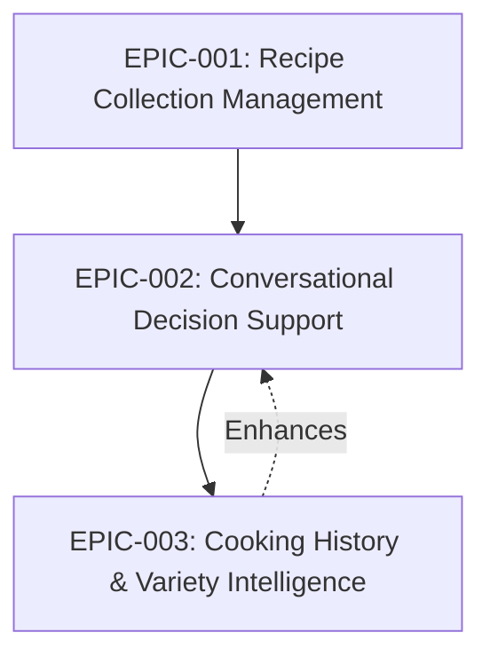
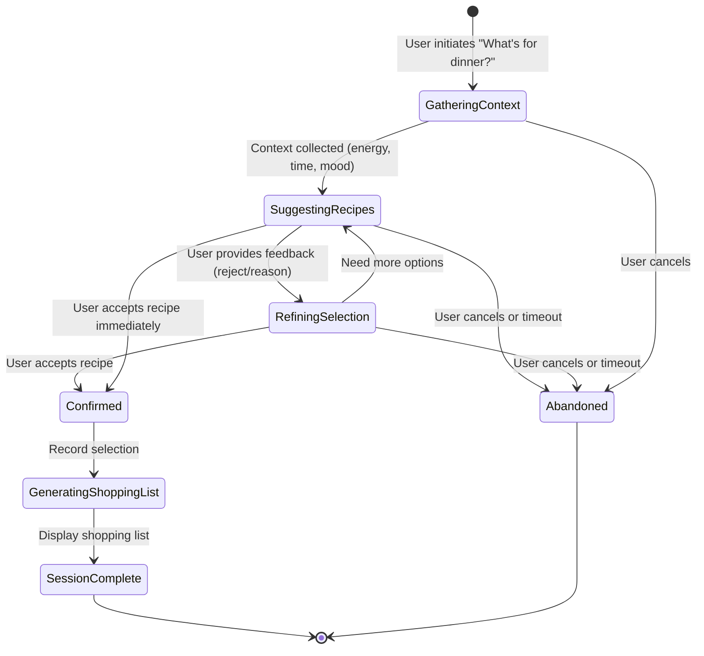
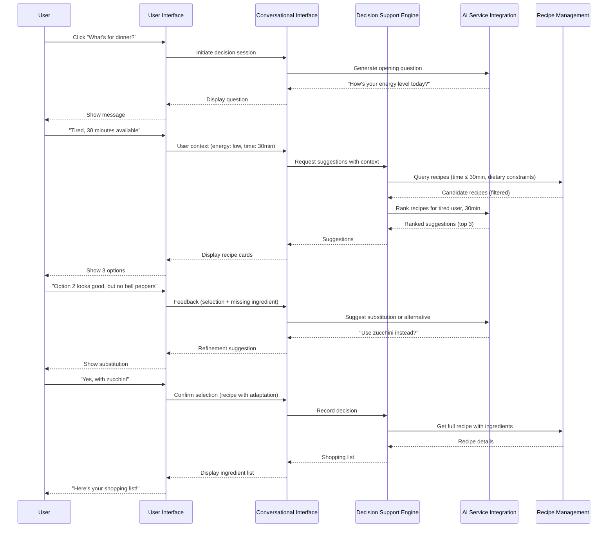
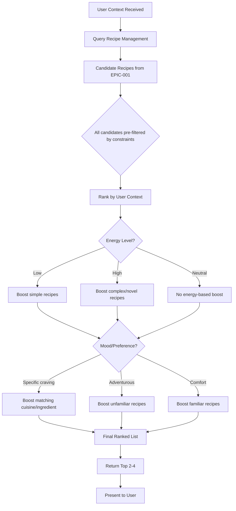

# Epic: Conversational Decision Support

## Specification Reference

**Source**: `thoughts/shared/specs/2025-12-25-SimpleKitchen.md`

**Related Spec Components**:
- Conversational Interface (component)
- Decision Support Engine (component)
- AI Service Integration (component)
- Ingredient Analysis (component)
- Conversation Context (data model entity - ephemeral)

**Mission Capability** (original):
- **Capability 1**: AI-Powered Conversational Decision Support
- **Capability 2**: Intelligent Recipe Suggestion Engine (basic version without history)
- **Capability 5**: Precise Ingredient List Generation
- **Capability 7**: Context-Aware Filtering (Time, Method, Servings) - partial

## Epic Summary

This epic delivers the core value proposition of SimpleKitchen: transforming the stressful question "What's for dinner?" into a confident answer through natural AI-powered conversation. Users initiate a decision session at the end of their workday, where the system asks contextual questions about their current state (energy level, mood, available time, shopping capability), suggests 2-4 recipes that match their context and constraints, iteratively refines suggestions based on feedback, and concludes by generating an exact shopping list once a recipe is confirmed. The entire experience takes less than 10 minutes and provides psychological relief by lifting the cognitive burden of decision-making.

**Value**: This is the "killer feature" that differentiates SimpleKitchen from static recipe databases. The conversational, adaptive approach meets users where they are emotionally and practically, making weeknight cooking feel achievable rather than overwhelming.

**Scope**: 
- **Included**: Decision session workflow, AI conversation orchestration, contextual question generation, recipe suggestion logic (basic ranking without history-based variety), user feedback handling, iterative refinement, recipe selection confirmation, shopping list generation, conversation state management
- **NOT Included**: Cooking history tracking or variety-based ranking (Epic 3), recipe storage or acquisition (Epic 1), recipe constraint validation (Epic 1 provides validated recipes)

## User Stories

This epic is composed of the following stories:

1. **Story: Decision Session Initiation**
   - **As a** user
   - **I want to** initiate a decision session with a simple action (e.g., "What's for dinner?" button or command)
   - **So that** the system understands I need help choosing tonight's meal

2. **Story: Contextual Question Generation**
   - **As a** user
   - **I want to** be asked relevant questions about my current state (mood, energy, time, shopping capability)
   - **So that** the system can understand my situation and suggest appropriate recipes

3. **Story: Initial Recipe Suggestions**
   - **As a** user
   - **I want to** receive 2-4 recipe suggestions that match my context and dietary constraints
   - **So that** I can evaluate options without being overwhelmed by too many choices

4. **Story: Feedback-Driven Refinement**
   - **As a** user
   - **I want to** provide feedback on suggestions (e.g., "I don't have bell peppers," "not in the mood for pasta," "too complex")
   - **So that** the system can refine its suggestions and find a better match

5. **Story: Iterative Suggestion Improvement**
   - **As a** system
   - **I want to** adapt suggestions based on user feedback within the current session
   - **So that** the user converges on a recipe they genuinely want to cook

6. **Story: Recipe Selection Confirmation**
   - **As a** user
   - **I want to** confirm my recipe choice when I find one I'm excited about
   - **So that** the system knows I've made a decision and can provide next steps

7. **Story: Shopping List Generation**
   - **As a** user
   - **I want to** receive a precise, scannable ingredient list with quantities and units
   - **So that** I can shop efficiently on my way home without guesswork

## System Behaviors (Technical Stories)

- **Behavior**: Conversation state management
  - **Why**: The system must maintain context across multiple conversation turns (user responses, suggested recipes, feedback history) to provide coherent, adaptive suggestions
  
- **Behavior**: AI prompt engineering for decision support
  - **Why**: The quality of suggestions depends on well-crafted prompts that include user context, recipe database metadata, constraints, and conversation history
  
- **Behavior**: Graceful AI service failure handling
  - **Why**: If the AI service is unavailable, the system should fall back to simpler rule-based filtering and inform the user of limited functionality
  
- **Behavior**: Recipe ranking algorithm (basic)
  - **Why**: The system must rank candidate recipes based on user context (energy level, time, mood) and constraints, even without history-based variety logic

## Research Questions for Researcher

These questions should be answered before planning implementation:

### Codebase Context
- [ ] This is a greenfield project—what application architecture supports conversational workflows well? (MVC, MVVM, state machine patterns)
- [ ] What UI frameworks or libraries provide good conversational interface components? (chat-style message lists, input forms, suggestion cards)

### External Knowledge
- [ ] What AI services or APIs are suitable for conversational decision support? (OpenAI GPT-4, Anthropic Claude, local LLMs like Llama)
- [ ] How should conversation state be managed across multiple turns? (session objects, state machines, conversation history arrays)
- [ ] What are effective prompting strategies for recipe suggestion and ranking? (few-shot examples, structured output, chain-of-thought reasoning)
- [ ] How to design prompts that incorporate user context, recipe metadata, and constraints?
- [ ] What are best practices for handling AI service failures gracefully? (timeouts, retries, fallback to simpler logic)
- [ ] How to implement iterative refinement in conversational AI? (tracking rejected suggestions, incorporating feedback into subsequent prompts)
- [ ] What are common UI patterns for conversational decision support? (message threads, suggestion cards, quick reply buttons)

### Constraints & Risks
- [ ] What are typical latency and cost characteristics of AI API calls? (response time, token costs, rate limits)
- [ ] How can conversation responsiveness be maintained (<5 seconds per turn) with external AI API calls?
- [ ] How to handle conversation abandonment? (user closes app mid-session, timeout strategies)
- [ ] How to prevent the conversation from becoming too long or frustrating? (turn limits, fallback to compromise suggestions)
- [ ] How to ensure suggestions feel intelligent and relevant, not random?
- [ ] How to handle edge cases like "no recipes match user context"? (suggest constraint relaxation, offer AI generation of custom recipe)

**Output Expected**: Research report in `thoughts/shared/research/2025-12-25-Conversational-Decision-Support.md`

## Acceptance Criteria for Planner

When this epic is complete, the following must be true:

### Functional Criteria (User-Facing)
- [ ] A user can initiate a decision session with a single action
- [ ] The system asks contextual questions about the user's state (energy, mood, time, shopping capability) in a natural, supportive tone
- [ ] The system adapts follow-up questions based on user responses (e.g., if user says "low energy," questions prioritize simplicity)
- [ ] The system suggests 2-4 recipes that match the user's context and dietary constraints
- [ ] Recipe suggestions feel relevant and thoughtful, not random (qualitative, user-perceived)
- [ ] A user can provide feedback on suggestions (missing ingredient, not in the mood, too complex, etc.)
- [ ] The system refines suggestions based on feedback (e.g., if user rejects pasta, don't suggest another pasta dish)
- [ ] A user can confirm a recipe selection
- [ ] When a recipe is confirmed, the system generates a complete shopping list with quantities and units (e.g., "2 tbsp olive oil", "1 lb chicken breast")
- [ ] The shopping list is accurate (matches the selected recipe exactly)
- [ ] The full decision session (from initiation to shopping list) completes in <10 minutes
- [ ] The conversation feels supportive and non-judgmental, not interrogative or robotic (qualitative, user-perceived)

### Technical Criteria (System-Level)
- [ ] Conversation Context entity exists (session ID, user context, suggested recipes, user feedback, turn count, current phase)
- [ ] Conversation state is maintained across multiple turns within a session
- [ ] AI Service Integration component sends prompts with user context, recipe metadata, and constraints
- [ ] AI Service Integration component receives and parses AI responses (questions, suggestions, rankings)
- [ ] Decision Support Engine queries Recipe Management for candidate recipes matching constraints
- [ ] Decision Support Engine ranks candidates based on user context (energy, time, mood)
- [ ] Ingredient Analysis component extracts ingredient list from selected recipe
- [ ] Ingredient Analysis component formats ingredients as "quantity unit name" strings
- [ ] System handles AI service failures gracefully (timeout, fallback to rule-based filtering, user notification)

### Quality Criteria (Testing/Verification)
- [ ] Integration tests demonstrate full decision session workflow (initiation → questions → suggestions → feedback → refinement → confirmation → shopping list)
- [ ] Integration tests verify that suggestions respect dietary constraints (no gluten or lactose)
- [ ] Integration tests verify that suggestions respect time constraints (30-45 minutes)
- [ ] Unit tests cover recipe ranking logic with various user contexts
- [ ] Unit tests cover ingredient list formatting and extraction
- [ ] Performance tests confirm conversation turns complete in <5 seconds (including AI API calls)
- [ ] User acceptance testing confirms conversation tone is supportive and suggestions feel relevant

**Output Expected**: Implementation plan(s) in `thoughts/shared/plans/2025-12-25-Conversational-Decision-Support-*.md`

## Dependencies

### Prerequisite Epics (MUST be complete before this epic)
- **EPIC-001**: Recipe Collection Management — Provides the validated recipe repository that this epic queries for suggestions; without recipes, there is nothing to suggest

### Concurrent Epics (CAN be developed in parallel)
- None (this epic is sequential after EPIC-001 and before EPIC-003)

### Dependent Epics (BLOCKED until this epic is complete)
- **EPIC-003**: Cooking History & Variety Intelligence — Requires the decision session workflow to exist before cooking sessions can be recorded; enhances this epic's suggestion logic with variety-based ranking

### Dependency Diagram

## Data Model Requirements

**Entities Involved**:
- **Recipe**: Reads recipes for suggestion (queries Recipe Management for candidates)
- **Conversation Context**: Creates and manages during active session (ephemeral, not persisted after session completion)
- **Dietary Profile**: Reads to inform suggestion ranking (indirectly through Recipe Management's constraint filtering)

**New Relationships**:
- Conversation Context references multiple Recipes (candidates and suggestions)
- Conversation Context is ephemeral (exists only during active decision session)

## External Interface Requirements

### User Interface
- **Decision Session View**: Chat-style conversational interface with message history, current question/prompt, user input field, and suggestion cards
- **Contextual Question Display**: System messages asking about user state (energy, mood, time, shopping capability) with optional quick-reply buttons or free-form text input
- **Recipe Suggestion Cards**: Display 2-4 recipes with key details (title, cooking time, cookware type, brief ingredient summary, optional image)
- **Feedback Input**: User can react to suggestions (accept, reject, provide reason for rejection like "missing ingredient" or "not in the mood")
- **Shopping List View**: Simple, scannable list of ingredients with quantities and units, formatted for easy shopping

### API (if applicable)
- **Initiate Decision Session Operation**: Creates new conversation context, returns session ID
- **Submit User Response Operation**: Accepts session ID and user message, processes response, returns next system message or suggestions
- **Confirm Recipe Selection Operation**: Accepts session ID and selected recipe ID, returns shopping list
- **Abandon Session Operation**: Accepts session ID, cleans up conversation context

### External Integrations (if applicable)
- **AI Service (for conversation and ranking)**: 
  - Sends conversation prompts with user context, recipe database context, constraints, and feedback history
  - Receives AI-generated responses: contextual questions, recipe rankings, refinement suggestions, ingredient substitutions
  - Handles API errors (timeout, rate limits, service unavailable) with graceful degradation

## Non-Functional Requirements

- **Performance**: Each conversation turn (user input → system response) must complete in <5 seconds to maintain natural flow
- **Usability**: Conversation tone must feel natural, supportive, and non-judgmental (not robotic or interrogative)
- **Reliability**: AI service failures must degrade gracefully (fall back to simpler filtering, inform user)
- **Responsiveness**: Full decision session (initiation to shopping list) must complete in <10 minutes (mission success criterion)

## Implementation Considerations (For Planner)

**Suggested Phases** (if the epic is large):
1. **Phase 1: Conversation Infrastructure**
   - Implement Conversation Context entity and state management
   - Build conversational UI components (message display, input, suggestion cards)
   - Create session lifecycle (initiate, maintain state, conclude)

2. **Phase 2: AI Service Integration**
   - Integrate AI service API (OpenAI, Anthropic, or local LLM)
   - Implement prompt engineering for contextual questions
   - Handle AI responses and parse structured output

3. **Phase 3: Recipe Suggestion Logic**
   - Implement Decision Support Engine's recipe querying
   - Build basic ranking algorithm (user context + constraints)
   - Integrate AI for ranking refinement

4. **Phase 4: Feedback and Refinement**
   - Capture user feedback on suggestions
   - Incorporate feedback into subsequent prompts
   - Implement iterative refinement loop

5. **Phase 5: Shopping List Generation**
   - Implement Ingredient Analysis component
   - Extract and format ingredient lists
   - Display shopping list on confirmation

6. **Phase 6: Error Handling and Fallbacks**
   - Implement AI service failure detection
   - Build fallback to rule-based filtering
   - Handle conversation edge cases (no matches, too many refinements)

**Known Constraints**:
- AI API calls may have latency (must complete in <5 seconds per turn)
- AI service may be unavailable (must have fallback strategy)
- Conversation must not feel endless (suggest compromise after 5-7 turns if no match)
- Suggestions must always respect dietary constraints (gluten-free, lactose-free)
- This epic does NOT implement history-based variety (that's Epic 3)

**Edge Cases to Consider**:
- What if no recipes match user context after filtering? (Suggest constraint relaxation or AI generation)
- What if user provides feedback that eliminates all remaining candidates? (Suggest compromise or broader search)
- What if user abandons conversation mid-session? (Clean up state, allow session resumption or restart)
- What if AI service returns invalid or nonsensical responses? (Retry, fallback to rule-based, inform user)
- What if user's time constraint is extremely tight (e.g., 15 minutes)? (Inform user no recipes match, suggest takeout or compromise)
- What if user's feedback is ambiguous? (Ask clarifying question)

## Open Questions

[Questions that arose during epic planning that need resolution]
- **Conversation State Persistence**: If the user closes the application mid-conversation, should the session resume on next launch, or should each session start fresh? (Current spec assumes fresh start)
- **AI Service Cost Management**: Conversational AI can be expensive with frequent API calls. Should the system implement caching, response reuse, or rate limiting to manage costs?
- **User Feedback Tracking**: Should the system track implicit feedback (recipes suggested but rejected frequently) to improve future suggestions, or only rely on explicit history (recipes actually cooked)? (May inform Epic 3)
- **Turn Limit Strategy**: How many refinement turns should be allowed before suggesting compromise? (5? 7? 10?)
- **Ingredient Substitution Intelligence**: How deeply should the system support ingredient substitution during conversation? (Simple AI suggestions vs. complex substitution engine)
- **Multi-Day Shopping**: If user decides on a recipe but can't shop immediately, should the shopping list persist for retrieval later?

## Verification Plan (For Implementor)

[How will we test that this epic is complete?]

**Manual Verification Steps**:
1. Launch application and initiate decision session ("What's for dinner?")
2. Verify system asks opening question about user state (energy, mood, time)
3. Respond with "Tired, only have 30 minutes, can't shop today"
4. Verify system adapts and suggests simple recipes
5. Review 2-4 recipe suggestions and verify they match constraints (time, dietary)
6. Reject first suggestion with feedback "Don't have bell peppers"
7. Verify system refines suggestions (suggests alternative or substitution)
8. Accept a recipe
9. Verify shopping list is generated with accurate quantities and units
10. Verify full session took <10 minutes
11. Test conversation tone for supportiveness (qualitative assessment)
12. Repeat with different contexts (high energy, adventurous mood, 45 minutes available)
13. Verify suggestions adapt to different contexts

**Automated Testing**:
- **Unit Tests**: 
  - Recipe ranking algorithm with various user contexts
  - Ingredient list extraction and formatting
  - Conversation state management (turn tracking, feedback history)
  - AI prompt generation with context and constraints
  
- **Integration Tests**: 
  - Full decision session workflow (initiation → questions → suggestions → refinement → confirmation → shopping list)
  - Constraint enforcement in suggestions (dietary, time)
  - Feedback incorporation into refinement
  - AI service integration (mocked responses)
  - Fallback behavior on AI service failure
  
- **End-to-End Tests**: 
  - Complete user journey from "What's for dinner?" to shopping list
  - Multiple refinement iterations
  - Edge case: No matching recipes (constraint relaxation suggestion)

**Performance Testing**:
- Measure conversation turn latency (target: <5 seconds)
- Measure full session duration (target: <10 minutes)

## Traceability

| User Story | Spec Component | Mission Capability | Acceptance Criteria |
|------------|----------------|--------------------|--------------------|
| Story 1: Session Initiation | Conversational Interface | Capability 1 (Conversational Decision Support) | Functional AC 1 |
| Story 2: Contextual Questions | Conversational Interface, AI Service Integration | Capability 1 (Conversational Decision Support) | Functional AC 2, 3, 12 |
| Story 3: Initial Suggestions | Decision Support Engine, Recipe Management | Capability 2 (Intelligent Suggestion Engine) | Functional AC 4, 5 |
| Story 4: Feedback Handling | Conversational Interface, Decision Support Engine | Capability 1 (Conversational Decision Support) | Functional AC 6, 7 |
| Story 5: Iterative Refinement | Decision Support Engine, AI Service Integration | Capability 1, 2 | Functional AC 7 |
| Story 6: Selection Confirmation | Conversational Interface, Decision Support Engine | Capability 1 | Functional AC 8 |
| Story 7: Shopping List | Ingredient Analysis, Recipe Management | Capability 5 (Ingredient List Generation) | Functional AC 9, 10 |

[Ensure every story traces back to spec and mission]

---

## Appendix: Supporting Materials

### State Machine: Decision Session Lifecycle

### Sequence Diagram: Full Decision Session Workflow

### Data Flow: Recipe Ranking Algorithm (Basic)

### Conversational Flow Example

**User**: "What's for dinner?"

**System**: "Hey! Let's figure out tonight's dinner together. How's your energy level right now—feeling energized, or more on the tired side?"

**User**: "Pretty tired, honestly. Long day."

**System**: "I hear you. How much time do you have for cooking tonight? And are you able to stop by the store on your way home?"

**User**: "Maybe 30 minutes for cooking. Yeah, I can shop."

**System**: "Perfect. Based on what you've told me, here are three ideas that should be quick and easy:

1. **One-Pan Lemon Garlic Chicken** (30 min, one pan) - Simple, flavorful, minimal cleanup
2. **Vegetable Stir-Fry** (25 min, one pan) - Colorful, light, lots of veggies
3. **Baked Salmon with Roasted Vegetables** (35 min, oven) - Hands-off after prep

Do any of these sound good, or should I suggest something different?"

**User**: "The stir-fry sounds good, but I don't have bell peppers."

**System**: "No problem! You can use zucchini or broccoli instead—both work great in stir-fries. Would you like to go with the stir-fry using zucchini?"

**User**: "Yeah, let's do that."

**System**: "Awesome! Here's your shopping list for Vegetable Stir-Fry:
- 1 lb chicken breast (or tofu)
- 2 medium zucchini
- 1 cup snap peas
- 3 cloves garlic
- 2 tbsp gluten-free soy sauce
- 1 tbsp sesame oil
- 1 cup cooked rice

You're all set! Enjoy your dinner tonight."
