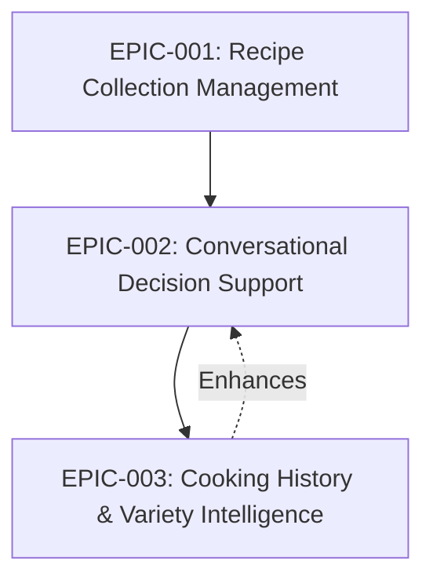
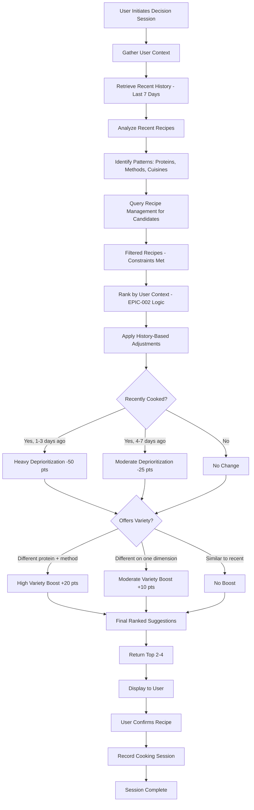
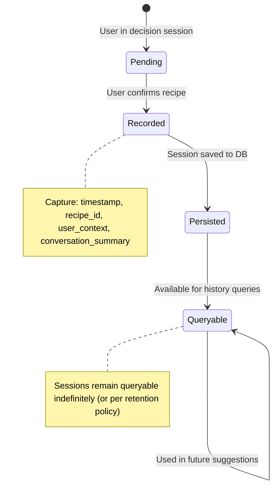

# Epic: Cooking History & Variety Intelligence

## Specification Reference

**Source**: `thoughts/shared/specs/2025-12-25-SimpleKitchen.md`

**Related Spec Components**:
- Cooking History (component)
- Decision Support Engine (component - enhancement)
- Local Data Persistence (component)
- Cooking Session (data model entity)

**Mission Capability** (original):
- **Capability 6**: Cooking History Tracking
- **Capability 2**: Intelligent Recipe Suggestion Engine (enhancement with variety logic)

## Epic Summary

This epic transforms the decision support system from reactive to intelligent by adding memory and variety promotion. The system tracks every cooking decision the user makes (timestamp, selected recipe, user context), analyzes patterns to identify recent repetition, and actively deprioritizes recently cooked recipes in future suggestions. This creates a natural cycle of diverse meals without requiring the user to consciously plan variety—the system ensures they don't eat pasta three nights in a row or repeat the same protein every day. Over weeks and months, users experience a rich, varied diet that feels effortless.

**Value**: Without memory, the decision support system would suggest the same recipes repeatedly, leading to boredom and disengagement. This epic delivers on the mission's promise of "recipe variety without effort" by making the system aware of past choices and proactively promoting diversity.

**Scope**: 
- **Included**: Recording cooking sessions, storing session history, querying recent history, identifying repetition patterns, deprioritizing recently cooked recipes in suggestions, promoting variety based on protein type/cooking method/cuisine, user-facing history view
- **NOT Included**: Advanced analytics or reporting (e.g., "you've cooked chicken 60% of the time"), nutritional tracking, recipe rating/favoriting, predictive suggestions based on day-of-week patterns

## User Stories

This epic is composed of the following stories:

1. **Story: Cooking Session Recording**
   - **As a** system
   - **I want to** record each cooking session when the user confirms a recipe selection
   - **So that** I have a complete history of what the user has cooked and when

2. **Story: Recent History Retrieval**
   - **As a** system
   - **I want to** retrieve cooking sessions from recent days (e.g., last 7 days)
   - **So that** I can analyze what the user has cooked recently to inform variety logic

3. **Story: Repetition Pattern Identification**
   - **As a** system
   - **I want to** identify patterns in cooking history (e.g., pasta cooked yesterday, chicken used 2 days ago, stir-fry method used 3 days ago)
   - **So that** I can detect when variety is lacking and adjust suggestions

4. **Story: Recipe Deprioritization Based on Recency**
   - **As a** system
   - **I want to** deprioritize recipes that are similar to recently cooked meals (same main ingredient, same cooking method, same cuisine)
   - **So that** suggestions naturally promote variety without user effort

5. **Story: Variety Promotion in Suggestions**
   - **As a** system
   - **I want to** boost recipes that offer variety (different protein, different cooking method, different cuisine) when ranking suggestions
   - **So that** users experience diverse meals over time

6. **Story: Cooking History Viewing**
   - **As a** user
   - **I want to** view my recent cooking history (dates and recipe names)
   - **So that** I can see what I've cooked lately and understand why certain suggestions are being made

## System Behaviors (Technical Stories)

- **Behavior**: Similarity detection between recipes
  - **Why**: To deprioritize recipes effectively, the system must understand what makes two recipes "similar" (same protein, same cooking method, same cuisine family)
  
- **Behavior**: Temporal weighting in deprioritization
  - **Why**: A recipe cooked yesterday should be deprioritized more heavily than one cooked 6 days ago (recency decay)
  
- **Behavior**: Variety dimension analysis
  - **Why**: The system should promote variety across multiple dimensions (protein type, cooking method, cuisine, ingredient categories) to prevent subtle repetition

## Research Questions for Researcher

These questions should be answered before planning implementation:

### Codebase Context
- [ ] How is the Decision Support Engine currently structured (from EPIC-002)? Where should history-based ranking logic be integrated?
- [ ] How is the Recipe data model structured (from EPIC-001)? What metadata exists for determining similarity (protein type, cooking method, cuisine tags)?

### External Knowledge
- [ ] What algorithms or heuristics effectively promote recipe variety in meal planning applications?
- [ ] How far back should history tracking look for variety purposes? (3 days, 7 days, 14 days, 30 days?)
- [ ] What defines "similarity" between recipes for variety purposes? (exact match, same protein, same cooking method, same cuisine, ingredient overlap)
- [ ] How should recency be weighted in deprioritization? (linear decay, exponential decay, threshold-based)
- [ ] What are common data models for tracking cooking sessions or meal history?
- [ ] How to balance variety promotion with user preferences? (what if user genuinely wants chicken every day?)
- [ ] What are effective UI patterns for displaying cooking history? (timeline, calendar, list view)

### Constraints & Risks
- [ ] How much history data should be retained? (full history forever, rolling window, configurable retention)
- [ ] What is the performance impact of history queries on every suggestion request?
- [ ] How to handle edge cases like "user only has 5 recipes total" (variety is inherently limited)?
- [ ] How to detect and handle deliberate repetition (user choosing the same recipe intentionally)?
- [ ] How to bootstrap the system when history is empty (no deprioritization initially)?

**Output Expected**: Research report in `thoughts/shared/research/2025-12-25-Cooking-History-Variety-Intelligence.md`

## Acceptance Criteria for Planner

When this epic is complete, the following must be true:

### Functional Criteria (User-Facing)
- [ ] When a user confirms a recipe selection in a decision session, the system automatically records a cooking session with timestamp, recipe, and user context
- [ ] The system retrieves cooking sessions from the last 7 days (minimum) when generating suggestions
- [ ] The system deprioritizes recipes similar to those cooked in the last 3 days (heavily deprioritized)
- [ ] The system deprioritizes recipes similar to those cooked 4-7 days ago (moderately deprioritized)
- [ ] Recipe suggestions demonstrate variety over time: different proteins, different cooking methods, different cuisines appear in rotation
- [ ] User experiences diverse meals over a 2-week period without conscious planning (qualitative, user-reported)
- [ ] A user can view their cooking history (list of recent sessions with dates and recipe names)

### Technical Criteria (System-Level)
- [ ] Cooking Session entity exists with: unique identifier, timestamp, recipe reference, user context (energy/time/mood), optional conversation summary
- [ ] Cooking Session data persists in Local Data Persistence with full CRUD support
- [ ] Cooking History component provides query interface: "get sessions in date range", "get recent sessions (N days)", "get sessions for specific recipe"
- [ ] Decision Support Engine integrates history-based ranking logic into existing suggestion algorithm (from EPIC-002)
- [ ] Recipe similarity is determined by: same primary protein, same cooking method, same cuisine family, or high ingredient overlap (configurable thresholds)
- [ ] Deprioritization weight decreases with time (e.g., 1 day ago = -50 points, 3 days ago = -25 points, 7 days ago = -10 points)
- [ ] Variety boost is applied to recipes that differ from recent history on multiple dimensions (e.g., different protein + different method = +20 points)

### Quality Criteria (Testing/Verification)
- [ ] Unit tests cover cooking session recording and retrieval
- [ ] Unit tests cover recipe similarity detection with various recipe pairs
- [ ] Unit tests cover deprioritization weighting with various time deltas
- [ ] Unit tests cover variety boost calculation
- [ ] Integration tests demonstrate history-enhanced suggestion workflow (cook recipe A on day 1, verify recipe A is deprioritized on day 2)
- [ ] Integration tests verify variety promotion over simulated multi-week period
- [ ] Performance tests confirm history queries do not degrade suggestion latency (still <1 second)
- [ ] User acceptance testing confirms diverse meals over 2+ weeks

**Output Expected**: Implementation plan(s) in `thoughts/shared/plans/2025-12-25-Cooking-History-Variety-Intelligence-*.md`

## Dependencies

### Prerequisite Epics (MUST be complete before this epic)
- **EPIC-002**: Conversational Decision Support — Provides the decision session workflow where cooking sessions are created; this epic records sessions and enhances suggestion logic

### Concurrent Epics (CAN be developed in parallel)
- None (this epic is sequential after EPIC-002)

### Dependent Epics (BLOCKED until this epic is complete)
- None (this is the final epic in the current scope)

### Dependency Diagram



## Data Model Requirements

**Entities Involved**:
- **Cooking Session**: Creates and reads (create when user confirms recipe, read for history queries)
- **Recipe**: Reads for similarity analysis (compare recipes to detect repetition)
- **Decision Support Engine**: Enhances with history-based ranking logic

**New Relationships**:
- Cooking Session references exactly one Recipe (many-to-one)
- Cooking Session is queried by Decision Support Engine for variety analysis

## External Interface Requirements

### User Interface
- **Cooking History View**: Displays list of recent cooking sessions with date, recipe name, and optional user context; supports date range filtering (e.g., "last 7 days", "last 30 days", "all time")
- **Decision Session View (Enhanced)**: No visual changes, but suggestions are now influenced by cooking history (users may notice better variety)

### API (if applicable)
- **Record Cooking Session Operation**: Accepts timestamp, recipe ID, user context, optional conversation summary; returns session ID
- **Query Recent History Operation**: Accepts number of days or date range; returns list of cooking sessions with recipe details
- **Get Session by ID Operation**: Accepts session ID; returns full session details

### External Integrations (if applicable)
- None (this epic is purely internal)

## Non-Functional Requirements

- **Performance**: History queries must complete in <1 second and not degrade overall suggestion latency
- **Reliability**: All cooking session data must persist durably with no data loss
- **Scalability**: History tracking must handle hundreds of sessions over months/years without performance issues
- **Usability**: Variety promotion should feel natural and effortless (user should not need to think about variety consciously)

## Implementation Considerations (For Planner)

**Suggested Phases** (if the epic is large):
1. **Phase 1: Cooking Session Data Model and Persistence**
   - Define Cooking Session entity schema
   - Implement storage and retrieval in Local Data Persistence
   - Create Cooking History component with query interface

2. **Phase 2: Session Recording Integration**
   - Integrate session recording into Decision Support Engine (when user confirms recipe)
   - Capture timestamp, recipe, and user context from conversation
   - Test session persistence

3. **Phase 3: Recipe Similarity Logic**
   - Define similarity criteria (protein, cooking method, cuisine, ingredient overlap)
   - Implement similarity detection algorithm
   - Test with various recipe pairs

4. **Phase 4: History-Based Ranking Enhancement**
   - Integrate history queries into Decision Support Engine's suggestion logic
   - Implement deprioritization based on recency
   - Implement variety boost based on difference from recent history

5. **Phase 5: Cooking History Viewing**
   - Build history view UI
   - Implement date range filtering
   - Display session details

6. **Phase 6: Tuning and Validation**
   - Test variety promotion over simulated weeks
   - Tune deprioritization weights and similarity thresholds
   - User acceptance testing for variety perception

**Known Constraints**:
- History-based ranking must not violate dietary or time constraints (those are still hard constraints)
- Variety logic is a "soft" influence (boost/deprioritize) not a hard filter
- Performance must remain fast (<1 second for suggestions) even with growing history
- System should handle empty history gracefully (no deprioritization when history is empty)

**Edge Cases to Consider**:
- What if user has only cooked 3-4 recipes total? (Variety is limited; accept some repetition)
- What if user deliberately chooses the same recipe multiple times? (Record sessions, but don't over-penalize user preference)
- What if user's context forces repetition? (e.g., always tired = always simple recipes; variety within "simple" category)
- What if all recent recipes are similar? (e.g., user cooked chicken 7 days in a row; system should strongly boost non-chicken options)
- What if history grows to thousands of sessions? (Query only recent N days, not full history)

## Open Questions

[Questions that arose during epic planning that need resolution]
- **History Retention Policy**: Should the system retain full history forever, or implement a rolling window (e.g., keep only last 90 days)? What are storage implications?
- **User Preference vs. Variety**: If a user consistently chooses the same type of recipe (e.g., always chicken), should the system continue deprioritizing it or recognize it as a preference?
- **Similarity Threshold Tuning**: How similar must two recipes be to trigger deprioritization? (e.g., chicken stir-fry vs. chicken curry: same protein, different cuisine—should they be considered similar?)
- **Variety Dimensions Priority**: Should the system prioritize protein variety over cooking method variety, or weight all dimensions equally?
- **Explicit User Feedback**: Should the system track implicit feedback (recipes suggested but rejected) to inform future suggestions, or only track explicit history (recipes cooked)? (This question was raised in EPIC-002 as well)
- **History View Utility**: How useful is the history view to users? Is it primarily informational, or should it support actions (e.g., "cook this again")?

## Verification Plan (For Implementor)

[How will we test that this epic is complete?]

**Manual Verification Steps**:
1. Complete a decision session and confirm a recipe (e.g., "Chicken Stir-Fry")
2. Navigate to cooking history view and verify session is recorded with date and recipe name
3. Initiate a new decision session the next day
4. Verify that "Chicken Stir-Fry" or similar chicken/stir-fry recipes are deprioritized or absent from suggestions
5. Confirm a different recipe (e.g., "Baked Salmon")
6. Repeat decision session on day 3
7. Verify both recent recipes (chicken, salmon) are deprioritized
8. Suggestions should favor different proteins/methods (e.g., pasta, vegetarian, etc.)
9. Over 2 weeks, complete 10-14 decision sessions and track recipe diversity
10. Verify diverse proteins, cooking methods, and cuisines appear across sessions
11. View full cooking history and verify all sessions are recorded

**Automated Testing**:
- **Unit Tests**: 
  - Cooking session creation and storage
  - History retrieval (last N days, date range)
  - Recipe similarity detection (same protein, same method, same cuisine, ingredient overlap)
  - Deprioritization weight calculation with various time deltas
  - Variety boost calculation with various recipe differences
  
- **Integration Tests**: 
  - End-to-end session recording when user confirms recipe in EPIC-002 workflow
  - History-enhanced suggestion workflow: cook recipe on day 1, verify deprioritization on day 2
  - Multi-day simulation: cook 7 different recipes over 7 days, verify 8th suggestion promotes variety
  - Performance test: history query with 100+ sessions
  
- **End-to-End Tests**: 
  - Full user journey over simulated 2-week period (14 decision sessions)
  - Verify recipe diversity across sessions
  - Verify history view displays all sessions correctly

**Longitudinal Testing** (user acceptance):
- User uses SimpleKitchen for 2+ weeks in real life
- User reports perception of variety (qualitative)
- User reviews cooking history and assesses diversity (qualitative)

## Traceability

| User Story | Spec Component | Mission Capability | Acceptance Criteria |
|------------|----------------|--------------------|--------------------|
| Story 1: Session Recording | Cooking History, Decision Support Engine | Capability 6 (Cooking History Tracking) | Functional AC 1; Technical AC 1, 2 |
| Story 2: History Retrieval | Cooking History | Capability 6 | Functional AC 2; Technical AC 3 |
| Story 3: Pattern Identification | Cooking History, Decision Support Engine | Capability 2 (Intelligent Suggestion - enhancement) | Technical AC 5 |
| Story 4: Recipe Deprioritization | Decision Support Engine | Capability 2 (Intelligent Suggestion - enhancement) | Functional AC 3, 4; Technical AC 6 |
| Story 5: Variety Promotion | Decision Support Engine | Capability 2 (Intelligent Suggestion - enhancement) | Functional AC 5, 6; Technical AC 7 |
| Story 6: History Viewing | Cooking History (UI component) | Capability 6 | Functional AC 7 |

[Ensure every story traces back to spec and mission]

---

## Appendix: Supporting Materials

### Workflow Diagram: History-Enhanced Suggestion Flow



### Similarity Matrix Example

| Recipe 1 | Recipe 2 | Same Protein? | Same Method? | Same Cuisine? | Ingredient Overlap | Similarity Score | Deprioritize? |
|----------|----------|---------------|--------------|---------------|--------------------|--------------------|---------------|
| Chicken Stir-Fry | Chicken Curry | Yes | No | No | 40% (chicken, garlic, ginger) | 0.6 | Yes |
| Chicken Stir-Fry | Beef Stir-Fry | No | Yes | Yes | 50% (soy sauce, garlic, veggies) | 0.7 | Yes |
| Chicken Stir-Fry | Baked Salmon | No | No | No | 10% (garlic) | 0.1 | No |
| Pasta Carbonara | Pasta Primavera | No (both pasta-based) | Yes (both pasta) | Yes (Italian) | 30% (pasta, garlic) | 0.8 | Yes |
| Pasta Carbonara | Thai Curry | No | No | No | 5% | 0.05 | No |

**Similarity Calculation** (example):
- Same protein: +0.4
- Same cooking method: +0.3
- Same cuisine: +0.2
- Ingredient overlap: (% overlap / 100) * 0.3
- **Threshold**: Similarity > 0.5 triggers deprioritization

### Deprioritization Weight by Recency

| Days Since Cooked | Deprioritization Weight | Rationale |
|-------------------|-------------------------|-----------|
| 0-1 days | -50 points | Just cooked; strong desire for variety |
| 2-3 days | -40 points | Very recent; still want to avoid |
| 4-5 days | -25 points | Recent enough to remember |
| 6-7 days | -10 points | Over a week ago; mild deprioritization |
| 8-14 days | -5 points | Two weeks ago; minimal deprioritization |
| 15+ days | 0 points | No deprioritization |

**Note**: These weights are applied to the ranking score calculated in EPIC-002. Negative weight decreases ranking, but does not eliminate the recipe (soft influence).

### Variety Boost by Difference Dimensions

| Difference from Recent History | Variety Boost | Example |
|-------------------------------|---------------|---------|
| Different protein + method + cuisine | +30 points | Recent: Chicken Stir-Fry → Suggest: Baked Salmon (fish, oven, Western) |
| Different protein + method | +20 points | Recent: Chicken Stir-Fry → Suggest: Beef Curry (beef, curry, Asian) |
| Different protein only | +10 points | Recent: Chicken Stir-Fry → Suggest: Pork Stir-Fry |
| Different method only | +10 points | Recent: Chicken Stir-Fry → Suggest: Baked Chicken |
| Different cuisine only | +5 points | Recent: Chicken Stir-Fry → Suggest: Chicken Curry |
| Similar on all dimensions | 0 points | Recent: Chicken Stir-Fry → Suggest: Chicken Teriyaki Stir-Fry |

**Note**: Variety boost is additive to the ranking score. Positive weight increases ranking.

### Cooking History View (Mockup Concept)

```
=== Cooking History ===

Filter: [Last 7 Days ▼]  [Last 30 Days]  [All Time]

📅 December 24, 2025 — Chicken Stir-Fry
   Context: Tired, 30 minutes
   
📅 December 23, 2025 — Baked Salmon with Vegetables
   Context: Moderate energy, 40 minutes
   
📅 December 21, 2025 — Vegetable Curry
   Context: Energized, 45 minutes
   
📅 December 19, 2025 — One-Pot Pasta Primavera
   Context: Tired, 30 minutes
   
📅 December 18, 2025 — Lemon Garlic Chicken
   Context: Moderate energy, 35 minutes

[Load More...]
```

### State Diagram: Cooking Session Lifecycle



### Example: Variety Promotion Over 2 Weeks

**Week 1:**
- Day 1: Chicken Stir-Fry (Asian, pan, chicken)
- Day 2: Baked Salmon (Western, oven, fish) ← variety boost applied
- Day 3: Vegetable Curry (Asian, pot, vegetarian) ← variety boost applied
- Day 4: Pasta Primavera (Italian, pot, pasta/vegetarian) ← variety boost applied
- Day 5: Lemon Garlic Chicken (Western, oven, chicken) ← chicken deprioritized but different method/cuisine
- Day 6: Beef Tacos (Mexican, pan, beef) ← variety boost applied
- Day 7: Thai Green Curry (Asian, pot, chicken) ← chicken deprioritized but different cuisine

**Week 2:**
- Day 8: One-Pan Pork Chops (Western, pan, pork) ← variety boost applied
- Day 9: Shrimp Stir-Fry (Asian, pan, seafood) ← stir-fry deprioritized but different protein
- Day 10: Baked Eggplant Parmesan (Italian, oven, vegetarian) ← variety boost applied
- Day 11: Chicken Fajitas (Mexican, pan, chicken) ← chicken deprioritized but new cuisine
- Day 12: Salmon Teriyaki (Asian, pan, fish) ← variety boost applied
- Day 13: Vegetable Stew (Western, pot, vegetarian) ← variety boost applied
- Day 14: Beef Stir-Fry (Asian, pan, beef) ← stir-fry deprioritized but different protein

**Variety Metrics:**
- Proteins: Chicken (4), Fish (3), Vegetarian (4), Beef (2), Pork (1) — Diverse!
- Methods: Pan (7), Oven (3), Pot (4) — Balanced!
- Cuisines: Asian (6), Western (4), Italian (2), Mexican (2) — Diverse!
- No recipe repeated exactly
- No protein repeated on consecutive days

**Conclusion**: System successfully promotes variety across multiple dimensions.
