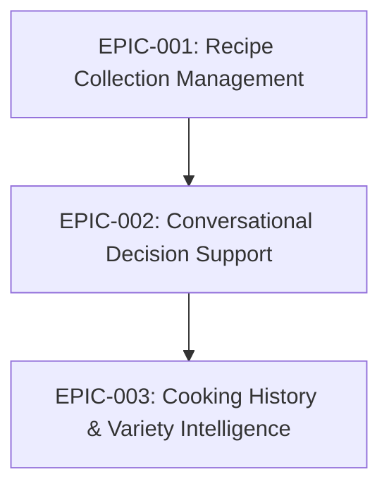
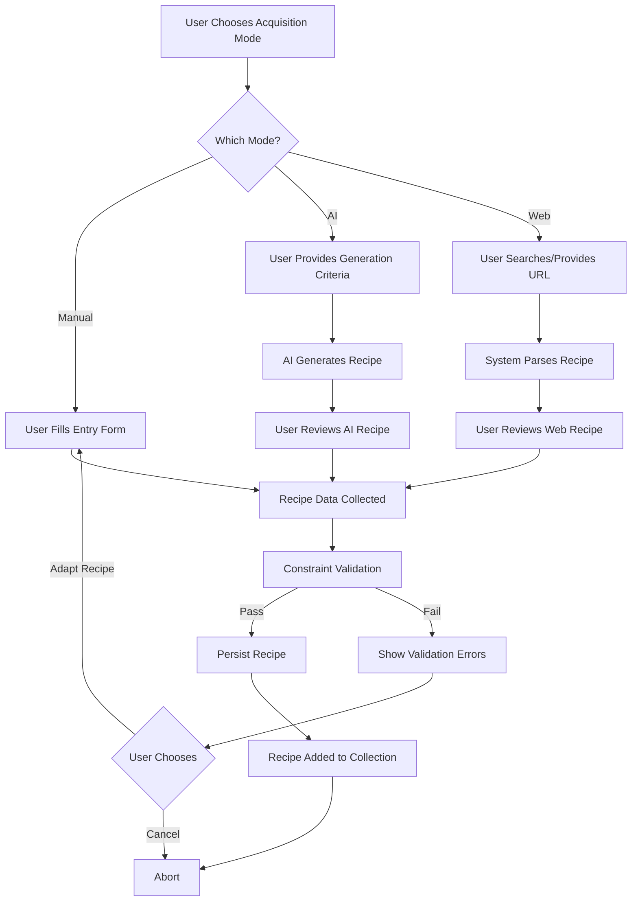
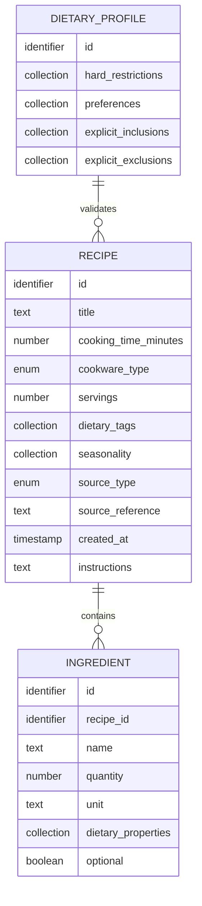

# Epic: Recipe Collection Management

## Specification Reference

**Source**: `thoughts/shared/specs/2025-12-25-SimpleKitchen.md`

**Related Spec Components**:
- Recipe Management (component)
- Constraint Enforcement (component)
- Recipe Discovery Service (component)
- Local Data Persistence (component)
- Recipe (data model entity)
- Ingredient (data model entity)
- Dietary Profile (data model entity)

**Mission Capability** (original):
- **Capability 3**: Multi-Modal Recipe Discovery and Storage
- **Capability 4**: Dietary Constraint Enforcement
- **Capability 7**: Context-Aware Filtering (Time, Method, Servings) - partial

## Epic Summary

This epic delivers a curated, safe, and growing recipe library that forms the foundation of the SimpleKitchen system. Users can build their recipe collection through three acquisition modes—AI generation, web search/import, and manual entry—with all recipes automatically validated against strict dietary and practical constraints (gluten-free, lactose-free, 30-45 minutes, minimal cookware, 2 servings). Once stored locally, recipes can be viewed and filtered by cooking time, cookware type, and dietary tags, providing a reliable knowledge base for future decision support.

**Value**: Without a rich, constraint-compliant recipe collection, the decision support system cannot function. This epic ensures users never see unsafe suggestions and can continuously expand their cooking repertoire through flexible acquisition methods.

**Scope**: 
- **Included**: Recipe addition (all three modes), dietary constraint validation, recipe storage and persistence, recipe viewing and filtering, ingredient management
- **NOT Included**: Recipe suggestion logic (Epic 2), cooking history tracking (Epic 3), conversational UI (Epic 2), AI conversation flows (Epic 2)

## User Stories

This epic is composed of the following stories:

1. **Story: Manual Recipe Entry**
   - **As a** user
   - **I want to** manually enter a recipe with ingredients, cooking time, cookware type, and dietary tags
   - **So that** I can preserve family recipes or personal adaptations in my collection

2. **Story: AI-Powered Recipe Generation**
   - **As a** user
   - **I want to** generate a new recipe by providing criteria (cuisine, ingredients, cooking method) to the AI
   - **So that** I can discover novel recipes tailored to my preferences without searching externally

3. **Story: Web Recipe Search and Import**
   - **As a** user
   - **I want to** search external recipe sources and import recipes I find appealing
   - **So that** I can leverage existing high-quality recipes from trusted sources

4. **Story: Automatic Dietary Constraint Validation**
   - **As a** system
   - **I want to** validate every recipe (new or imported) against the user's dietary restrictions
   - **So that** no recipe containing gluten or lactose is ever stored or suggested

5. **Story: Recipe Viewing and Filtering**
   - **As a** user
   - **I want to** view my recipe collection and filter by cooking time, cookware type, and dietary tags
   - **So that** I can explore available options and manually select recipes when desired

6. **Story: Local Recipe Persistence**
   - **As a** system
   - **I want to** persist all recipe data locally with durability guarantees
   - **So that** the user's recipe collection is never lost and is available across application restarts

## System Behaviors (Technical Stories)

- **Behavior**: Ingredient dietary property determination
  - **Why**: The system must automatically identify which ingredients contain gluten, lactose, or other dietary concerns to enforce constraints reliably
  
- **Behavior**: Recipe schema enforcement
  - **Why**: All recipes must conform to a consistent structure (title, ingredients with quantities/units, cooking time, cookware type, servings, dietary tags, source metadata) to support filtering and validation

- **Behavior**: Constraint violation feedback
  - **Why**: When a recipe fails validation, users need clear, actionable reasons (e.g., "Recipe contains butter, which has lactose") to understand why it was rejected and how to adapt it

## Research Questions for Researcher

These questions should be answered before planning implementation:

### Codebase Context
- [ ] This is a greenfield project—no existing codebase. What project structure and technology stack would best suit a local-first, single-user application with AI integration?
- [ ] What are common file/directory structures for organizing recipe data, application logic, and user interface code?

### External Knowledge
- [ ] What local data persistence solutions are suitable for this use case? (embedded databases like SQLite, file-based storage, object databases)
- [ ] What recipe schema/data models are commonly used in cooking applications? (e.g., schema.org Recipe standard, custom models)
- [ ] How do existing recipe applications handle dietary constraint validation? (lookup tables, AI inference, crowdsourced data)
- [ ] What web scraping or API approaches exist for importing recipes from external sources? (HTML parsing, recipe APIs like Spoonacular, browser extensions)
- [ ] How should ingredient dietary properties be determined? (static lookup table with common ingredients, AI-based analysis, user-editable database)
- [ ] What are best practices for validating recipe cooking time, cookware requirements, and servings?
- [ ] What libraries or frameworks exist for AI service integration (OpenAI, Anthropic, local LLM APIs)?

### Constraints & Risks
- [ ] What are the performance characteristics of different persistence solutions for collections of 1000+ recipes?
- [ ] How should the system handle ingredient ambiguity? (e.g., "hard cheese" may be lactose-free for some users but not others)
- [ ] What are the failure modes for web recipe import? (broken HTML parsing, missing data, incompatible formats)
- [ ] How can recipe validation be made 100% reliable to avoid false negatives (never suggesting a violating recipe)?

**Output Expected**: Research report in `thoughts/shared/research/2025-12-25-Recipe-Collection-Management.md`

## Acceptance Criteria for Planner

When this epic is complete, the following must be true:

### Functional Criteria (User-Facing)
- [ ] A user can manually enter a recipe with all required fields (title, ingredients with quantities/units, cooking time, cookware type, dietary tags) and it is stored successfully
- [ ] A user can request AI generation of a recipe by providing criteria (e.g., "quick stir-fry with chicken"), review the generated recipe, and add it to their collection
- [ ] A user can search external recipe sources (web), select a recipe, import it (with automatic or manual adaptation for dietary constraints), and store it
- [ ] The system rejects any recipe containing gluten or lactose with a clear error message explaining the violation
- [ ] The system rejects recipes outside the 30-45 minute cooking time window or using excessive cookware with clear explanations
- [ ] A user can view their entire recipe collection in a list or grid view
- [ ] A user can filter recipes by cooking time range, cookware type (one-pot, one-pan, oven), and dietary tags (gluten-free, lactose-free, etc.)
- [ ] Recipe data persists across application restarts (no data loss)

### Technical Criteria (System-Level)
- [ ] All recipes conform to a consistent schema with required fields: title, cooking time (minutes), cookware type (enum), servings (must equal 2), dietary tags (collection), seasonality (collection), source type (manual, AI-generated, web-imported), source reference (URL if applicable), ingredient list (with quantities and units), optional instructions
- [ ] Ingredient entities include: name, quantity, unit, dietary properties (collection: contains-gluten, contains-lactose, etc.), optional flag
- [ ] Dietary Profile entity exists with hard restrictions (gluten-free, lactose-free), preferences, explicit inclusions, and explicit exclusions
- [ ] Constraint validation runs before any recipe is persisted and blocks storage of non-compliant recipes
- [ ] Recipe collection can scale to 1000+ recipes without performance degradation (queries complete in <1 second)

### Quality Criteria (Testing/Verification)
- [ ] Unit tests cover constraint validation logic with 100% coverage for dietary restrictions (zero false negatives)
- [ ] Integration tests demonstrate all three recipe acquisition modes (manual, AI, web) end-to-end
- [ ] Integration tests verify that recipes violating each constraint type are properly rejected
- [ ] Performance tests confirm recipe filtering remains fast (<1 second) with 1000+ recipe dataset

**Output Expected**: Implementation plan(s) in `thoughts/shared/plans/2025-12-25-Recipe-Collection-Management-*.md`

## Dependencies

### Prerequisite Epics (MUST be complete before this epic)
- None (this is the foundational epic)

### Concurrent Epics (CAN be developed in parallel)
- None (other epics depend on this one)

### Dependent Epics (BLOCKED until this epic is complete)
- **EPIC-002**: Conversational Decision Support — Requires a populated recipe collection to suggest recipes to users
- **EPIC-003**: Cooking History & Variety Intelligence — Requires recipes to exist before cooking sessions can reference them

### Dependency Diagram

## Data Model Requirements

**Entities Involved**:
- **Recipe**: Creates and manages (full CRUD: create via three modes, read for viewing/filtering, update for editing, delete for removal)
- **Ingredient**: Creates as child entities of Recipe (create when recipe is added, read for display, update when recipe is edited, delete when recipe is deleted)
- **Dietary Profile**: Reads for constraint validation (must be configured before recipes can be validated)

**New Relationships**:
- Recipe has many Ingredients (one-to-many composition)
- Dietary Profile filters Recipes (conceptual validation relationship)

## External Interface Requirements

### User Interface
- **Recipe Entry Form**: User inputs title, cooking time, cookware type, servings, dietary tags, seasonality, ingredients (with add/remove rows for each ingredient: name, quantity, unit, optional flag), and optional instructions
- **AI Recipe Generation Dialog**: User enters generation criteria (cuisine, main ingredient, cooking method, constraints), reviews AI-generated recipe, and confirms or cancels
- **Web Recipe Import Workflow**: User enters search query or URL, system displays candidate recipes or parses provided URL, user selects and reviews recipe, system validates and flags any constraint violations, user confirms or adapts recipe
- **Recipe Collection View**: Displays list/grid of all recipes with title, cooking time, cookware type, dietary tags; supports filtering controls (time range slider, cookware checkboxes, dietary tag checkboxes)
- **Recipe Detail View**: Shows full recipe information including ingredients with quantities, instructions, source reference

### API (if applicable)
- **Add Recipe Operation**: Accepts recipe data (from any source), validates against constraints, returns success or validation errors
- **Query Recipes Operation**: Accepts filter criteria (time range, cookware type, dietary tags), returns matching recipes
- **Get Recipe by ID Operation**: Accepts recipe identifier, returns full recipe details including ingredients

### External Integrations (if applicable)
- **AI Service (for recipe generation)**: Sends recipe generation request with criteria and constraints, receives AI-generated recipe in structured format
- **Web Recipe Sources (optional)**: Sends search query or URL, receives recipe data (title, ingredients, cooking time, instructions, source URL); handles parsing errors gracefully

## Non-Functional Requirements

- **Performance**: Recipe queries and filtering must complete in <1 second even with 1000+ recipes
- **Security**: Dietary constraint enforcement must be 100% reliable with zero false negatives (never store a violating recipe)
- **Reliability**: All recipe data must persist durably across application restarts with no data loss
- **Usability**: Constraint validation errors must provide clear, actionable feedback (not just "validation failed")
- **Scalability**: Recipe collection must handle growth to thousands of recipes without performance degradation

## Implementation Considerations (For Planner)

**Suggested Phases** (if the epic is large):
1. **Phase 1: Data Model and Persistence Foundation**
   - Define Recipe and Ingredient schemas
   - Implement local data persistence layer
   - Create Dietary Profile configuration

2. **Phase 2: Constraint Enforcement System**
   - Build dietary constraint validation logic
   - Implement time, cookware, and servings validation
   - Create ingredient dietary property determination approach

3. **Phase 3: Recipe Acquisition - Manual Entry**
   - Build manual recipe entry form
   - Integrate validation into entry workflow
   - Implement recipe storage

4. **Phase 4: Recipe Acquisition - AI Generation**
   - Integrate AI service for recipe generation
   - Implement generation criteria interface
   - Validate AI-generated recipes before storage

5. **Phase 5: Recipe Acquisition - Web Import**
   - Implement web search or URL-based import
   - Build recipe parsing and adaptation logic
   - Handle import errors gracefully

6. **Phase 6: Recipe Viewing and Filtering**
   - Build recipe collection view
   - Implement filtering controls and query logic
   - Create recipe detail view

**Known Constraints**:
- Single-user system (no multi-user access or account management needed)
- Local-first architecture (all data stored locally, no cloud sync)
- Dietary constraints are hard requirements (never violate gluten-free, lactose-free)
- All recipes must fit 30-45 minute cooking time, minimal cookware, 2 servings

**Edge Cases to Consider**:
- What if AI generates a recipe that violates constraints? (Validation should catch and reject it)
- What if web-imported recipe is missing required fields? (Prompt user to fill in missing data)
- What if ingredient dietary properties are ambiguous? (Flag for user confirmation)
- What if user wants to store a recipe that violates constraints "just for reference"? (Current spec says reject; confirm with user or allow "inactive" storage?)
- What if user edits a recipe after storage and violates constraints? (Re-validate on save)

## Open Questions

[Questions that arose during epic planning that need resolution]
- **Ingredient Dietary Property Database**: Should the system use a static lookup table (requires maintenance), AI inference (requires validation), or user-editable database for determining which ingredients contain gluten/lactose?
- **Recipe Adaptation for Dietary Constraints**: When importing a web recipe that contains forbidden ingredients (e.g., wheat pasta), should the system automatically suggest substitutions (e.g., gluten-free pasta) or require manual adaptation?
- **Recipe Versioning**: If a user edits a recipe after storage, should the system track versions or simply overwrite? Should original web-imported recipes be preserved?
- **Seasonality Data Source**: How should the system determine seasonal ingredients? Static calendar, geographic-aware, user-customizable?
- **Explicit Inclusions/Exclusions**: How should the system handle user-specified exceptions (e.g., "hard cheese allowed despite lactose-free profile")?

## Verification Plan (For Implementor)

[How will we test that this epic is complete?]

**Manual Verification Steps**:
1. Launch application and navigate to "Add Recipe" → "Manual Entry"
2. Enter a valid recipe (e.g., gluten-free pasta with olive oil, garlic, vegetables; 30 minutes, one-pot, 2 servings)
3. Save recipe and verify it appears in recipe collection
4. Attempt to enter an invalid recipe (e.g., contains wheat flour)
5. Verify system rejects with clear error message
6. Navigate to "Add Recipe" → "AI Generation"
7. Enter criteria "quick chicken stir-fry" and review generated recipe
8. Confirm and verify it is stored
9. Navigate to "Add Recipe" → "Web Import"
10. Search for or import a recipe URL
11. Review imported recipe, adapt if needed, and store
12. View recipe collection and apply filters (e.g., "one-pan, 30-45 minutes")
13. Verify filtered results match criteria
14. Restart application and verify all recipes persist

**Automated Testing**:
- **Unit Tests**: 
  - Dietary constraint validation (test gluten detection, lactose detection, explicit inclusions/exclusions)
  - Time constraint validation (accept 30-45 min, reject outside range)
  - Cookware constraint validation (accept one-pot/pan/oven, reject multi-cookware)
  - Servings constraint validation (accept 2, reject other values)
  - Ingredient parsing and formatting
  
- **Integration Tests**: 
  - End-to-end manual recipe entry and storage
  - End-to-end AI recipe generation and storage
  - End-to-end web recipe import and storage
  - Recipe query and filtering with various criteria
  - Recipe persistence and retrieval after restart
  - Constraint violation rejection for each constraint type
  
- **End-to-End Tests**: 
  - Complete recipe addition workflow (all three modes) from UI to persistence
  - Complete recipe viewing and filtering workflow from UI query to display

## Traceability

| User Story | Spec Component | Mission Capability | Acceptance Criteria |
|------------|----------------|--------------------|--------------------|
| Story 1: Manual Entry | Recipe Management, Recipe Discovery Service | Capability 3 (Multi-Modal Discovery) | Functional AC 1 |
| Story 2: AI Generation | Recipe Discovery Service, AI Service Integration | Capability 3 (Multi-Modal Discovery) | Functional AC 2 |
| Story 3: Web Import | Recipe Discovery Service | Capability 3 (Multi-Modal Discovery) | Functional AC 3 |
| Story 4: Constraint Validation | Constraint Enforcement, Dietary Profile | Capability 4 (Dietary Constraint Enforcement) | Functional AC 4, 5; Technical AC 2, 3, 4 |
| Story 5: Viewing/Filtering | Recipe Management | Capability 3 (Multi-Modal Discovery) | Functional AC 6, 7 |
| Story 6: Persistence | Local Data Persistence | Capability 3 (Multi-Modal Discovery) | Functional AC 8; Technical AC 5 |

[Ensure every story traces back to spec and mission]

---

## Appendix: Supporting Materials

### Workflow Diagram: Recipe Addition with Validation

### Data Model Diagram: Recipe and Ingredient Relationship

