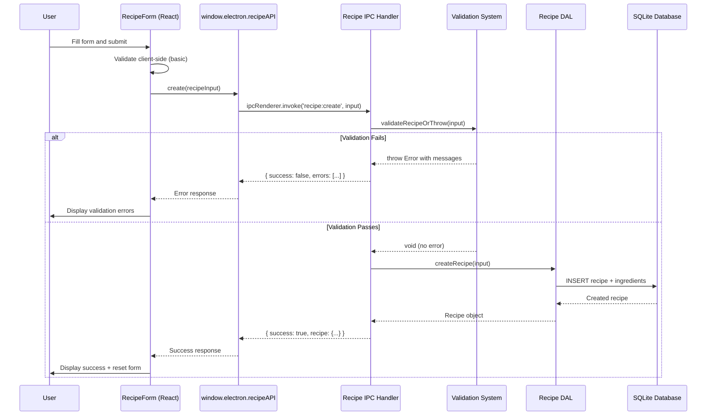

# Phase 3: Manual Recipe Entry - Implementation Plan

## Inputs

- **Research Report**: `thoughts/shared/research/2025-12-25-Recipe-Collection-Management.md`
- **Epic**: `thoughts/shared/epics/2025-12-25-Recipe-Collection-Management.md`
- **Master Plan**: `thoughts/shared/plans/2025-12-25-Recipe-Collection-Management-MASTER.md`
- **Phase 0 State**: `thoughts/shared/plans/2025-12-25-Recipe-Collection-Phase0-Stack-Selection-STATE.md` (COMPLETE)
- **Phase 1 State**: `thoughts/shared/plans/2025-12-26-Recipe-Collection-Phase1-Data-Persistence-STATE.md` (COMPLETE)
- **Phase 2 State**: `thoughts/shared/plans/2025-12-26-Recipe-Collection-Phase2-Constraint-Validation-STATE.md` (COMPLETE)

## Verified Current State

**Fact:** Phase 0, 1, and 2 are complete with all tests passing.  
**Evidence:** STATE files show all tasks completed (18/18, 15/15, 15/15 respectively)  
**Excerpt:** Phase 0: "Current Task: COMPLETE", Phase 1: "Completed: 15 / 15 ✅", Phase 2: "Completed: 15 / 15 ✅"

**Fact:** Database layer with Recipe and Ingredient CRUD operations exists.  
**Evidence:** `src/main/database/dal/recipes.ts:28-79`  
**Excerpt:** 
```typescript
export async function createRecipe(input: CreateRecipeInput): Promise<Recipe> {
  const recipeId = randomUUID();
  // Validate recipe before persisting
  await validateRecipeOrThrow(input);
  // Insert recipe and ingredients...
}
```

**Fact:** Validation orchestrator integrates all constraint validators.  
**Evidence:** `src/main/validation/validator.ts:10-49`  
**Excerpt:**
```typescript
export async function validateRecipe(
  recipeInput: CreateRecipeInput | UpdateRecipeInput
): Promise<ValidationResult> {
  const errors: ValidationError[] = [];
  // Run all validators in parallel...
}
```

**Fact:** Recipe type definitions include CreateRecipeInput with all required fields.  
**Evidence:** `src/shared/types/recipe.ts:50-63`  
**Excerpt:**
```typescript
export interface CreateRecipeInput {
  title: string;
  cookingTimeMinutes: number;
  cookwareType: CookwareType;
  servings: number;
  dietaryTags: DietaryTag[];
  seasonality: Season[];
  sourceType: SourceType;
  ingredients: CreateIngredientInput[];
}
```

**Fact:** Electron main process and renderer exist but renderer only has placeholder App.  
**Evidence:** `src/renderer/App.tsx` exists in file listing, `src/main/main.ts` exists  
**Excerpt:** File structure shows basic Electron setup from Phase 0

**Fact:** No IPC handlers exist yet for recipe operations.  
**Evidence:** `src/main/main.ts` exists but doesn't export IPC handlers (verified from file listing - no `ipc/` directory)  
**Excerpt:** Directory listing shows `src/main/` contains only `database/`, `validation/`, not `ipc/`

**Fact:** No React components exist beyond the placeholder App.  
**Evidence:** `src/renderer/` only contains `App.tsx`, `main.tsx`, `index.html`, `styles/global.css`  
**Excerpt:** No `components/` directory in renderer

## Goals / Non-Goals

### Goals
- Deliver end-to-end manual recipe entry workflow (User Story 1 from Epic)
- Build React form UI for recipe creation with dynamic ingredient rows
- Implement secure IPC communication between renderer and main process
- Integrate with existing database DAL and validation system
- Display validation errors with actionable feedback
- Store recipes successfully and display confirmation
- Achieve Milestone MVP 1: "Users can manually add constraint-compliant recipes"

### Non-Goals
- Recipe editing (UPDATE operation) - deferred to future phase
- Recipe viewing/browsing UI - Phase 4
- Recipe deletion UI - Phase 4
- AI generation - Phase 5
- Web import - Phase 6
- Advanced form features (autosave, drafts, multi-step wizard)

## Design Overview

### Architecture Pattern: Electron IPC with Type-Safe Handlers

**Renderer → Main Communication:**
1. User fills form in renderer process (React)
2. Clicks "Save Recipe" button
3. Renderer calls `window.electron.recipeAPI.create(recipeInput)`
4. IPC message sent to main process via preload script (contextBridge)
5. Main process handler validates and persists via DAL
6. Success/error response returned to renderer
7. Renderer displays confirmation or validation errors

**Component Structure:**
```
src/renderer/
├── components/
│   ├── RecipeForm/
│   │   ├── RecipeForm.tsx          # Main form container
│   │   ├── RecipeBasicInfo.tsx     # Title, times, cookware, servings
│   │   ├── RecipeDietaryTags.tsx   # Dietary tag checkboxes
│   │   ├── RecipeSeasonality.tsx   # Season checkboxes
│   │   ├── IngredientList.tsx      # Dynamic ingredient rows
│   │   ├── IngredientRow.tsx       # Single ingredient input
│   │   └── ValidationErrors.tsx    # Error display component
│   └── common/
│       ├── Button.tsx
│       ├── Input.tsx
│       ├── Select.tsx
│       └── Checkbox.tsx
├── pages/
│   └── AddRecipePage.tsx           # Page wrapper for RecipeForm
└── App.tsx                         # Router (will add in this phase)
```

**IPC Handlers:**
```
src/main/
├── ipc/
│   ├── recipe-handlers.ts          # IPC handlers for recipe operations
│   └── index.ts                    # Handler registration
└── main.ts                         # Electron app initialization (register handlers)
```

**Updated Preload:**
```
src/main/preload.ts                 # Expose recipeAPI via contextBridge
```

### Data Flow for Manual Entry



## Implementation Instructions (For Implementor)

---

### **Action ID:** PLAN-301
**Change Type:** create  
**File(s):** `src/shared/types/electron.d.ts`  
**Instruction:** Add RecipeAPI interface to electron type definitions.

Add the following interface to the existing `ElectronAPI`:
```typescript
recipeAPI: {
  create: (input: CreateRecipeInput) => Promise<{ 
    success: boolean; 
    recipe?: Recipe; 
    errors?: Array<{ field: string; message: string }>; 
  }>;
}
```

**Evidence:** `src/shared/types/electron.d.ts` exists (shown in file listing)  
**Done When:** TypeScript compilation succeeds, `window.electron.recipeAPI.create` is typed in renderer code

---

### **Action ID:** PLAN-302
**Change Type:** create  
**File(s):** `src/main/ipc/recipe-handlers.ts`  
**Instruction:** Create IPC handler for recipe creation.

Implementation:
1. Import `ipcMain`, `createRecipe` from DAL, `CreateRecipeInput`, `Recipe` types
2. Create `registerRecipeHandlers()` function
3. Implement `recipe:create` handler:
   - Accept `CreateRecipeInput` from event args
   - Call `createRecipe(input)` (validation happens in DAL)
   - Catch errors and parse validation messages
   - Return `{ success: true, recipe }` on success
   - Return `{ success: false, errors: [...] }` on validation failure
4. Export `registerRecipeHandlers`

**Pseudocode:**
```typescript
export function registerRecipeHandlers() {
  ipcMain.handle('recipe:create', async (_event, input: CreateRecipeInput) => {
    try {
      const recipe = await createRecipe(input);
      return { success: true, recipe };
    } catch (error) {
      // Parse error message and extract field-level errors
      const errorMsg = error.message;
      if (errorMsg.includes('Recipe validation failed:')) {
        const lines = errorMsg.split('\n').slice(1); // Skip first line
        const errors = lines.map(line => {
          const [field, ...msgParts] = line.split(':');
          return { field: field.trim(), message: msgParts.join(':').trim() };
        });
        return { success: false, errors };
      }
      return { success: false, errors: [{ field: 'general', message: errorMsg }] };
    }
  });
}
```

**Evidence:** No IPC directory exists yet (verified from file listing)  
**Done When:** Handler compiles, TypeScript types match electron.d.ts interface

---

### **Action ID:** PLAN-303
**Change Type:** create  
**File(s):** `src/main/ipc/index.ts`  
**Instruction:** Create IPC barrel export for handler registration.

Implementation:
```typescript
import { registerRecipeHandlers } from './recipe-handlers';

export function registerAllHandlers() {
  registerRecipeHandlers();
}
```

**Evidence:** Standard Electron pattern for organizing IPC handlers  
**Done When:** File compiles without errors

---

### **Action ID:** PLAN-304
**Change Type:** modify  
**File(s):** `src/main/main.ts`  
**Instruction:** Register IPC handlers in Electron app initialization.

1. Import `registerAllHandlers` from `./ipc`
2. Call `registerAllHandlers()` before `app.whenReady()` or inside the ready handler
3. Ensure handlers are registered before any renderer can connect

**Evidence:** `src/main/main.ts` exists and initializes Electron app (Phase 0)  
**Done When:** Application starts without errors, handlers are registered before window creation

---

### **Action ID:** PLAN-305
**Change Type:** modify  
**File(s):** `src/main/preload.ts`  
**Instruction:** Expose recipeAPI via contextBridge in preload script.

Add to existing `contextBridge.exposeInMainWorld('electron', { ... })`:
```typescript
recipeAPI: {
  create: (input: CreateRecipeInput) => ipcRenderer.invoke('recipe:create', input),
}
```

Import `CreateRecipeInput` type at top of file.

**Evidence:** `src/main/preload.ts` exists (Phase 0)  
**Done When:** Renderer can call `window.electron.recipeAPI.create()`, TypeScript recognizes type

---

### **Action ID:** PLAN-306
**Change Type:** create  
**File(s):** `src/renderer/components/common/Button.tsx`  
**Instruction:** Create reusable Button component.

Implementation:
```typescript
import React from 'react';

interface ButtonProps extends React.ButtonHTMLAttributes<HTMLButtonElement> {
  variant?: 'primary' | 'secondary' | 'danger';
  loading?: boolean;
}

export function Button({ 
  variant = 'primary', 
  loading = false, 
  disabled, 
  children, 
  ...props 
}: ButtonProps) {
  const variantClasses = {
    primary: 'bg-blue-600 hover:bg-blue-700 text-white',
    secondary: 'bg-gray-200 hover:bg-gray-300 text-gray-800',
    danger: 'bg-red-600 hover:bg-red-700 text-white',
  };

  return (
    <button
      className={`px-4 py-2 rounded font-medium transition-colors disabled:opacity-50 disabled:cursor-not-allowed ${variantClasses[variant]}`}
      disabled={disabled || loading}
      {...props}
    >
      {loading ? 'Loading...' : children}
    </button>
  );
}
```

**Evidence:** No common components exist yet (file listing shows no `components/` directory)  
**Done When:** Button renders correctly, supports variants and loading state

---

### **Action ID:** PLAN-307
**Change Type:** create  
**File(s):** `src/renderer/components/common/Input.tsx`  
**Instruction:** Create reusable Input component with label and error display.

Implementation:
```typescript
import React from 'react';

interface InputProps extends React.InputHTMLAttributes<HTMLInputElement> {
  label: string;
  error?: string;
  required?: boolean;
}

export function Input({ label, error, required, ...props }: InputProps) {
  return (
    <div className="mb-4">
      <label className="block text-sm font-medium text-gray-700 mb-1">
        {label}
        {required && <span className="text-red-500 ml-1">*</span>}
      </label>
      <input
        className={`w-full px-3 py-2 border rounded-md focus:outline-none focus:ring-2 ${
          error 
            ? 'border-red-500 focus:ring-red-500' 
            : 'border-gray-300 focus:ring-blue-500'
        }`}
        {...props}
      />
      {error && <p className="text-red-500 text-sm mt-1">{error}</p>}
    </div>
  );
}
```

**Evidence:** Standard React form component pattern  
**Done When:** Input renders with label, shows error styling when error prop provided

---

### **Action ID:** PLAN-308
**Change Type:** create  
**File(s):** `src/renderer/components/common/Select.tsx`  
**Instruction:** Create reusable Select dropdown component.

Implementation:
```typescript
import React from 'react';

interface SelectProps extends React.SelectHTMLAttributes<HTMLSelectElement> {
  label: string;
  error?: string;
  required?: boolean;
  options: Array<{ value: string; label: string }>;
}

export function Select({ label, error, required, options, ...props }: SelectProps) {
  return (
    <div className="mb-4">
      <label className="block text-sm font-medium text-gray-700 mb-1">
        {label}
        {required && <span className="text-red-500 ml-1">*</span>}
      </label>
      <select
        className={`w-full px-3 py-2 border rounded-md focus:outline-none focus:ring-2 ${
          error 
            ? 'border-red-500 focus:ring-red-500' 
            : 'border-gray-300 focus:ring-blue-500'
        }`}
        {...props}
      >
        <option value="">Select...</option>
        {options.map(opt => (
          <option key={opt.value} value={opt.value}>{opt.label}</option>
        ))}
      </select>
      {error && <p className="text-red-500 text-sm mt-1">{error}</p>}
    </div>
  );
}
```

**Evidence:** Needed for cookware type selection (enum)  
**Done When:** Select renders with options, shows error styling

---

### **Action ID:** PLAN-309
**Change Type:** create  
**File(s):** `src/renderer/components/common/Checkbox.tsx`  
**Instruction:** Create reusable Checkbox component for dietary tags and seasonality.

Implementation:
```typescript
import React from 'react';

interface CheckboxProps extends Omit<React.InputHTMLAttributes<HTMLInputElement>, 'type'> {
  label: string;
}

export function Checkbox({ label, ...props }: CheckboxProps) {
  return (
    <label className="flex items-center space-x-2 cursor-pointer">
      <input
        type="checkbox"
        className="w-4 h-4 text-blue-600 border-gray-300 rounded focus:ring-blue-500"
        {...props}
      />
      <span className="text-sm text-gray-700">{label}</span>
    </label>
  );
}
```

**Evidence:** Needed for multiple-selection fields (dietaryTags, seasonality)  
**Done When:** Checkbox renders with label, supports checked state

---

### **Action ID:** PLAN-310
**Change Type:** create  
**File(s):** `src/renderer/components/RecipeForm/IngredientRow.tsx`  
**Instruction:** Create single ingredient input row component.

Implementation:
1. Accept props: `index`, `ingredient` (state object), `onChange` callback, `onRemove` callback
2. Render 4 inputs in a row: name, quantity, unit, optional checkbox
3. Include "Remove" button (only show if index > 0 to ensure at least 1 ingredient)
4. Call `onChange(index, field, value)` on input changes
5. Call `onRemove(index)` on remove button click

**Pseudocode:**
```typescript
interface IngredientRowProps {
  index: number;
  ingredient: { name: string; quantity: string; unit: string; optional: boolean };
  onChange: (index: number, field: string, value: string | boolean) => void;
  onRemove: (index: number) => void;
}

export function IngredientRow({ index, ingredient, onChange, onRemove }: IngredientRowProps) {
  return (
    <div className="grid grid-cols-12 gap-2 mb-2">
      <input /* name */ className="col-span-5" />
      <input /* quantity */ type="number" className="col-span-2" />
      <input /* unit */ className="col-span-2" />
      <label /* optional checkbox */ className="col-span-2" />
      {index > 0 && <button /* remove */ className="col-span-1" />}
    </div>
  );
}
```

**Evidence:** Dynamic ingredient list is core requirement (Epic Story 1)  
**Done When:** Row renders 4 inputs, remove button works, onChange/onRemove callbacks fire correctly

---

### **Action ID:** PLAN-311
**Change Type:** create  
**File(s):** `src/renderer/components/RecipeForm/IngredientList.tsx`  
**Instruction:** Create ingredient list manager with add/remove functionality.

Implementation:
1. Accept props: `ingredients` (array of ingredient state), `setIngredients` (state setter), `errors` (validation errors for ingredients)
2. Render `IngredientRow` for each ingredient
3. Provide "Add Ingredient" button to append new empty ingredient
4. Handle onChange to update specific ingredient in array
5. Handle onRemove to remove ingredient from array
6. Display validation errors for ingredients if present

**Pseudocode:**
```typescript
interface IngredientListProps {
  ingredients: Array<{ name: string; quantity: string; unit: string; optional: boolean }>;
  setIngredients: (ingredients: Array<...>) => void;
  errors?: Array<{ field: string; message: string }>;
}

export function IngredientList({ ingredients, setIngredients, errors }: IngredientListProps) {
  const handleChange = (index, field, value) => {
    const updated = [...ingredients];
    updated[index][field] = value;
    setIngredients(updated);
  };

  const handleRemove = (index) => {
    setIngredients(ingredients.filter((_, i) => i !== index));
  };

  const handleAdd = () => {
    setIngredients([...ingredients, { name: '', quantity: '', unit: '', optional: false }]);
  };

  return (
    <div>
      <label>Ingredients *</label>
      {ingredients.map((ing, i) => <IngredientRow key={i} index={i} ... />)}
      <button onClick={handleAdd}>+ Add Ingredient</button>
      {/* Display ingredient-related errors */}
    </div>
  );
}
```

**Evidence:** Required for user story (manual entry with ingredients)  
**Done When:** Can add/remove ingredients, state updates correctly, at least 1 ingredient always present

---

### **Action ID:** PLAN-312
**Change Type:** create  
**File(s):** `src/renderer/components/RecipeForm/RecipeBasicInfo.tsx`  
**Instruction:** Create component for basic recipe fields (title, times, cookware, servings).

Implementation:
1. Accept props: form state object, onChange handler, errors object
2. Render Input for title
3. Render Input (number) for cookingTimeMinutes
4. Render Input (number, optional) for prepTimeMinutes
5. Render Select for cookwareType (options: one-pot, one-pan, oven)
6. Render Input (number, readonly value=2) for servings (fixed to 2 per spec)
7. Display field-specific errors

**Pseudocode:**
```typescript
interface RecipeBasicInfoProps {
  formData: {
    title: string;
    cookingTimeMinutes: string;
    prepTimeMinutes: string;
    cookwareType: string;
  };
  onChange: (field: string, value: string) => void;
  errors?: Array<{ field: string; message: string }>;
}

export function RecipeBasicInfo({ formData, onChange, errors }: RecipeBasicInfoProps) {
  const getError = (field: string) => errors?.find(e => e.field === field)?.message;

  return (
    <div>
      <Input label="Recipe Title" value={formData.title} onChange={(e) => onChange('title', e.target.value)} error={getError('title')} required />
      <Input label="Cooking Time (minutes)" type="number" value={formData.cookingTimeMinutes} onChange={...} error={getError('cookingTimeMinutes')} required />
      <Input label="Prep Time (minutes)" type="number" value={formData.prepTimeMinutes} onChange={...} />
      <Select label="Cookware Type" value={formData.cookwareType} onChange={...} options={[
        { value: 'one-pot', label: 'One Pot' },
        { value: 'one-pan', label: 'One Pan' },
        { value: 'oven', label: 'Oven' }
      ]} error={getError('cookwareType')} required />
      <Input label="Servings" type="number" value="2" disabled />
    </div>
  );
}
```

**Evidence:** All fields map to `CreateRecipeInput` type (recipe.ts:51-63)  
**Done When:** All inputs render, validation errors display correctly, servings is fixed to 2

---

### **Action ID:** PLAN-313
**Change Type:** create  
**File(s):** `src/renderer/components/RecipeForm/RecipeDietaryTags.tsx`  
**Instruction:** Create component for dietary tag checkboxes.

Implementation:
1. Accept props: `selectedTags` (array of DietaryTag), `onChange` (callback), `errors`
2. Define available tags: gluten-free, lactose-free, vegetarian, vegan, low-carb, keto, paleo
3. Render Checkbox for each tag
4. On checkbox change, add/remove tag from selectedTags array
5. Display validation errors if any

**Pseudocode:**
```typescript
interface RecipeDietaryTagsProps {
  selectedTags: string[];
  onChange: (tags: string[]) => void;
  errors?: Array<{ field: string; message: string }>;
}

const DIETARY_TAGS = [
  { value: 'gluten-free', label: 'Gluten-Free' },
  { value: 'lactose-free', label: 'Lactose-Free' },
  { value: 'vegetarian', label: 'Vegetarian' },
  { value: 'vegan', label: 'Vegan' },
  // ... more tags
];

export function RecipeDietaryTags({ selectedTags, onChange, errors }: RecipeDietaryTagsProps) {
  const handleToggle = (tag: string) => {
    const updated = selectedTags.includes(tag)
      ? selectedTags.filter(t => t !== tag)
      : [...selectedTags, tag];
    onChange(updated);
  };

  return (
    <div>
      <label>Dietary Tags</label>
      <div className="grid grid-cols-2 gap-2">
        {DIETARY_TAGS.map(tag => (
          <Checkbox 
            key={tag.value} 
            label={tag.label} 
            checked={selectedTags.includes(tag.value)} 
            onChange={() => handleToggle(tag.value)} 
          />
        ))}
      </div>
    </div>
  );
}
```

**Evidence:** dietaryTags is array field in CreateRecipeInput (recipe.ts:57)  
**Done When:** Can select/deselect tags, state updates correctly

---

### **Action ID:** PLAN-314
**Change Type:** create  
**File(s):** `src/renderer/components/RecipeForm/RecipeSeasonality.tsx`  
**Instruction:** Create component for seasonality checkboxes.

Implementation:
1. Accept props: `selectedSeasons` (array of Season), `onChange` (callback)
2. Define seasons: spring, summer, fall, winter, any
3. Render Checkbox for each season
4. On checkbox change, add/remove season from selectedSeasons array
5. If no seasons selected, default to "any" when submitting

**Pseudocode:**
```typescript
interface RecipeSeasonalityProps {
  selectedSeasons: string[];
  onChange: (seasons: string[]) => void;
}

const SEASONS = [
  { value: 'spring', label: 'Spring' },
  { value: 'summer', label: 'Summer' },
  { value: 'fall', label: 'Fall' },
  { value: 'winter', label: 'Winter' },
  { value: 'any', label: 'Any Season' },
];

export function RecipeSeasonality({ selectedSeasons, onChange }: RecipeSeasonalityProps) {
  const handleToggle = (season: string) => {
    const updated = selectedSeasons.includes(season)
      ? selectedSeasons.filter(s => s !== season)
      : [...selectedSeasons, season];
    onChange(updated);
  };

  return (
    <div>
      <label>Seasonality</label>
      <div className="flex gap-4">
        {SEASONS.map(season => (
          <Checkbox 
            key={season.value} 
            label={season.label} 
            checked={selectedSeasons.includes(season.value)} 
            onChange={() => handleToggle(season.value)} 
          />
        ))}
      </div>
    </div>
  );
}
```

**Evidence:** seasonality is array field in CreateRecipeInput (recipe.ts:58)  
**Done When:** Can select/deselect seasons, state updates correctly

---

### **Action ID:** PLAN-315
**Change Type:** create  
**File(s):** `src/renderer/components/RecipeForm/ValidationErrors.tsx`  
**Instruction:** Create component to display validation errors in a clear, actionable format.

Implementation:
```typescript
interface ValidationErrorsProps {
  errors: Array<{ field: string; message: string }>;
}

export function ValidationErrors({ errors }: ValidationErrorsProps) {
  if (errors.length === 0) return null;

  return (
    <div className="bg-red-50 border border-red-200 rounded-md p-4 mb-4">
      <h3 className="text-red-800 font-semibold mb-2">
        Please fix the following errors:
      </h3>
      <ul className="list-disc list-inside text-red-700 text-sm">
        {errors.map((error, i) => (
          <li key={i}>
            <strong>{error.field}:</strong> {error.message}
          </li>
        ))}
      </ul>
    </div>
  );
}
```

**Evidence:** Spec requirement for "actionable validation errors" (Epic line 84)  
**Done When:** Errors display in red box, field names are bolded, messages are clear

---

### **Action ID:** PLAN-316
**Change Type:** create  
**File(s):** `src/renderer/components/RecipeForm/RecipeForm.tsx`  
**Instruction:** Create main RecipeForm component orchestrating all sub-components.

Implementation:
1. Initialize state for all form fields (title, cookingTimeMinutes, prepTimeMinutes, cookwareType, dietaryTags, seasonality, ingredients, instructions)
2. Initialize state for validation errors and submission status (loading, success)
3. Render RecipeBasicInfo, RecipeDietaryTags, RecipeSeasonality, IngredientList, Instructions textarea
4. On form submit:
   - Prevent default
   - Set loading state
   - Determine dietaryProperties for each ingredient (call helper function)
   - Build CreateRecipeInput object
   - Call `window.electron.recipeAPI.create(input)`
   - Handle response: set errors or show success
   - Reset form on success
5. Display ValidationErrors if present
6. Display success message if recipe created

**Pseudocode:**
```typescript
export function RecipeForm() {
  const [formData, setFormData] = useState({
    title: '',
    cookingTimeMinutes: '',
    prepTimeMinutes: '',
    cookwareType: '',
    dietaryTags: [],
    seasonality: [],
    ingredients: [{ name: '', quantity: '', unit: '', optional: false }],
    instructions: '',
  });
  const [errors, setErrors] = useState([]);
  const [loading, setLoading] = useState(false);
  const [success, setSuccess] = useState(false);

  const handleSubmit = async (e) => {
    e.preventDefault();
    setLoading(true);
    setErrors([]);
    setSuccess(false);

    // Build CreateRecipeInput
    const input: CreateRecipeInput = {
      title: formData.title,
      cookingTimeMinutes: parseInt(formData.cookingTimeMinutes),
      prepTimeMinutes: formData.prepTimeMinutes ? parseInt(formData.prepTimeMinutes) : undefined,
      cookwareType: formData.cookwareType as CookwareType,
      servings: 2, // Fixed
      dietaryTags: formData.dietaryTags as DietaryTag[],
      seasonality: formData.seasonality.length > 0 ? formData.seasonality as Season[] : ['any'],
      sourceType: 'manual',
      instructions: formData.instructions || undefined,
      ingredients: formData.ingredients.map((ing, i) => ({
        name: ing.name,
        quantity: parseFloat(ing.quantity),
        unit: ing.unit,
        dietaryProperties: determineDietaryProperties(ing.name), // Helper function
        optional: ing.optional,
        orderIndex: i + 1,
      })),
    };

    const result = await window.electron.recipeAPI.create(input);
    
    setLoading(false);

    if (result.success) {
      setSuccess(true);
      // Reset form
      setFormData({ ... });
    } else {
      setErrors(result.errors || []);
    }
  };

  return (
    <form onSubmit={handleSubmit}>
      <h1>Add New Recipe</h1>
      {success && <div className="success-message">Recipe added successfully!</div>}
      <ValidationErrors errors={errors} />
      <RecipeBasicInfo ... />
      <RecipeDietaryTags ... />
      <RecipeSeasonality ... />
      <IngredientList ... />
      <textarea /* instructions */ />
      <Button type="submit" loading={loading}>Save Recipe</Button>
    </form>
  );
}
```

**Evidence:** Orchestrates all form components, integrates with IPC  
**Done When:** Form submits, creates recipe on success, displays errors on failure, resets after success

---

### **Action ID:** PLAN-317
**Change Type:** create  
**File(s):** `src/renderer/utils/ingredient-classifier.ts`  
**Instruction:** Create helper function to determine dietary properties for ingredients during form submission.

Implementation:
1. Import static ingredient database (will need to expose it or duplicate minimal version)
2. Create `determineDietaryProperties(ingredientName: string): DietaryProperty[]` function
3. Normalize ingredient name (lowercase, trim)
4. Look up in static database
5. Return dietary properties array (or empty if unknown - validation will catch violations)

**Pseudocode:**
```typescript
import type { DietaryProperty } from '../../shared/types/database';

// Minimal ingredient database for client-side classification
const INGREDIENT_DATABASE: Record<string, DietaryProperty[]> = {
  'butter': ['contains-lactose'],
  'milk': ['contains-lactose'],
  'cheese': ['contains-lactose'],
  'wheat flour': ['contains-gluten'],
  'bread': ['contains-gluten'],
  // ... copy from static ingredient database or import
};

export function determineDietaryProperties(ingredientName: string): DietaryProperty[] {
  const normalized = ingredientName.toLowerCase().trim();
  return INGREDIENT_DATABASE[normalized] || [];
}
```

**Evidence:** Ingredients need dietaryProperties populated (recipe.ts:35), ingredient-database exists in main process (validation/ingredient-database.ts)  
**Done When:** Function returns correct dietary properties for known ingredients, empty array for unknown

---

### **Action ID:** PLAN-318
**Change Type:** create  
**File(s):** `src/renderer/pages/AddRecipePage.tsx`  
**Instruction:** Create page wrapper for RecipeForm.

Implementation:
```typescript
import React from 'react';
import { RecipeForm } from '../components/RecipeForm/RecipeForm';

export function AddRecipePage() {
  return (
    <div className="container mx-auto px-4 py-8 max-w-4xl">
      <RecipeForm />
    </div>
  );
}
```

**Evidence:** Standard page wrapper pattern  
**Done When:** Page renders RecipeForm in centered container

---

### **Action ID:** PLAN-319
**Change Type:** modify  
**File(s):** `src/renderer/App.tsx`  
**Instruction:** Update App component to display AddRecipePage (simple routing or direct render for MVP).

For MVP Phase 3, directly render AddRecipePage (no routing library needed yet):
```typescript
import React from 'react';
import { AddRecipePage } from './pages/AddRecipePage';

export default function App() {
  return (
    <div className="min-h-screen bg-gray-50">
      <AddRecipePage />
    </div>
  );
}
```

**Evidence:** App.tsx exists as placeholder (Phase 0)  
**Done When:** Application loads and displays recipe form

---

### **Action ID:** PLAN-320
**Change Type:** modify  
**File(s):** `src/renderer/styles/global.css`  
**Instruction:** Add Tailwind CSS directives and base styles.

Add at the top:
```css
@tailwind base;
@tailwind components;
@tailwind utilities;

/* Base styles */
* {
  box-sizing: border-box;
}

body {
  margin: 0;
  font-family: -apple-system, BlinkMacSystemFont, 'Segoe UI', 'Roboto', 'Oxygen',
    'Ubuntu', 'Cantarell', 'Fira Sans', 'Droid Sans', 'Helvetica Neue',
    sans-serif;
  -webkit-font-smoothing: antialiased;
  -moz-osx-font-smoothing: grayscale;
}
```

**Evidence:** Tailwind classes used in components, global.css exists (Phase 0)  
**Done When:** Tailwind classes render correctly, base styles applied

---

### **Action ID:** PLAN-321
**Change Type:** create  
**File(s):** `tailwind.config.js`  
**Instruction:** Configure Tailwind CSS for the renderer process.

Create config:
```javascript
/** @type {import('tailwindcss').Config} */
module.exports = {
  content: [
    './src/renderer/**/*.{js,jsx,ts,tsx}',
  ],
  theme: {
    extend: {},
  },
  plugins: [],
}
```

**Evidence:** Tailwind classes used throughout components  
**Done When:** Tailwind builds CSS, classes apply styling

---

### **Action ID:** PLAN-322
**Change Type:** create  
**File(s):** `postcss.config.js`  
**Instruction:** Configure PostCSS for Tailwind processing.

Create config:
```javascript
module.exports = {
  plugins: {
    tailwindcss: {},
    autoprefixer: {},
  },
}
```

**Evidence:** Required for Tailwind CSS processing in Vite  
**Done When:** PostCSS processes Tailwind directives without errors

---

### **Action ID:** PLAN-323
**Change Type:** modify  
**File(s):** `package.json`  
**Instruction:** Install Tailwind CSS dependencies.

Run: `npm install -D tailwindcss autoprefixer postcss`

Add to package.json scripts section (if not already present):
```json
"tailwind:watch": "tailwindcss -i ./src/renderer/styles/global.css -o ./dist/renderer/styles/output.css --watch"
```

**Evidence:** Tailwind classes used in components require Tailwind installed  
**Done When:** `npm install` succeeds, tailwind binary available, types work in TypeScript

---

### **Action ID:** PLAN-324
**Change Type:** create  
**File(s):** `src/renderer/components/RecipeForm/RecipeForm.test.tsx`  
**Instruction:** Create integration test for RecipeForm component.

Implementation:
1. Use Vitest + React Testing Library
2. Mock `window.electron.recipeAPI.create`
3. Test: Render form with all fields
4. Test: Submit valid recipe → success message displayed, form reset
5. Test: Submit invalid recipe (missing title) → validation errors displayed
6. Test: Add/remove ingredients → ingredient count updates
7. Test: Toggle dietary tags → state updates

**Pseudocode:**
```typescript
import { describe, it, expect, vi, beforeEach } from 'vitest';
import { render, screen, fireEvent, waitFor } from '@testing-library/react';
import { RecipeForm } from './RecipeForm';

describe('RecipeForm', () => {
  beforeEach(() => {
    // Mock IPC
    global.window.electron = {
      recipeAPI: {
        create: vi.fn(),
      },
    };
  });

  it('renders all form fields', () => {
    render(<RecipeForm />);
    expect(screen.getByLabelText(/recipe title/i)).toBeInTheDocument();
    expect(screen.getByLabelText(/cooking time/i)).toBeInTheDocument();
    // ... more assertions
  });

  it('submits valid recipe successfully', async () => {
    global.window.electron.recipeAPI.create.mockResolvedValue({ success: true, recipe: {} });
    render(<RecipeForm />);
    
    fireEvent.change(screen.getByLabelText(/recipe title/i), { target: { value: 'Test Recipe' } });
    // ... fill other fields
    fireEvent.click(screen.getByText(/save recipe/i));
    
    await waitFor(() => {
      expect(screen.getByText(/recipe added successfully/i)).toBeInTheDocument();
    });
  });

  it('displays validation errors on failure', async () => {
    global.window.electron.recipeAPI.create.mockResolvedValue({ 
      success: false, 
      errors: [{ field: 'title', message: 'Title is required' }] 
    });
    render(<RecipeForm />);
    
    fireEvent.click(screen.getByText(/save recipe/i));
    
    await waitFor(() => {
      expect(screen.getByText(/title is required/i)).toBeInTheDocument();
    });
  });
});
```

**Evidence:** Integration testing required for quality criteria (Epic line 451-453)  
**Done When:** All tests pass, form behavior verified

---

### **Action ID:** PLAN-325
**Change Type:** create  
**File(s):** `src/main/ipc/recipe-handlers.test.ts`  
**Instruction:** Create unit test for IPC recipe handlers.

Implementation:
1. Mock `createRecipe` DAL function
2. Mock `ipcMain.handle` to capture handler function
3. Test: Valid recipe input → handler calls createRecipe, returns success
4. Test: Invalid recipe (validation error) → handler returns errors array
5. Test: Unexpected error → handler returns general error

**Pseudocode:**
```typescript
import { describe, it, expect, vi, beforeEach } from 'vitest';
import { registerRecipeHandlers } from './recipe-handlers';
import * as recipeDAL from '../database/dal/recipes';

vi.mock('../database/dal/recipes');

describe('Recipe IPC Handlers', () => {
  let handlerFn: any;

  beforeEach(() => {
    const ipcMain = {
      handle: vi.fn((channel, fn) => {
        if (channel === 'recipe:create') handlerFn = fn;
      }),
    };
    global.ipcMain = ipcMain;
    registerRecipeHandlers();
  });

  it('returns success when recipe is created', async () => {
    const mockRecipe = { id: '123', title: 'Test', ... };
    vi.mocked(recipeDAL.createRecipe).mockResolvedValue(mockRecipe);

    const result = await handlerFn(null, { title: 'Test', ... });

    expect(result.success).toBe(true);
    expect(result.recipe).toEqual(mockRecipe);
  });

  it('returns errors when validation fails', async () => {
    vi.mocked(recipeDAL.createRecipe).mockRejectedValue(
      new Error('Recipe validation failed:\ntitle: Title is required')
    );

    const result = await handlerFn(null, { title: '', ... });

    expect(result.success).toBe(false);
    expect(result.errors).toHaveLength(1);
    expect(result.errors[0].field).toBe('title');
  });
});
```

**Evidence:** IPC handlers need testing for reliability  
**Done When:** All tests pass, error parsing works correctly

---

### **Action ID:** PLAN-326
**Change Type:** create  
**File(s):** `src/renderer/utils/ingredient-classifier.test.ts`  
**Instruction:** Create unit test for ingredient classifier.

Implementation:
```typescript
import { describe, it, expect } from 'vitest';
import { determineDietaryProperties } from './ingredient-classifier';

describe('determineDietaryProperties', () => {
  it('identifies gluten in wheat flour', () => {
    const result = determineDietaryProperties('wheat flour');
    expect(result).toContain('contains-gluten');
  });

  it('identifies lactose in butter', () => {
    const result = determineDietaryProperties('butter');
    expect(result).toContain('contains-lactose');
  });

  it('returns empty array for unknown ingredient', () => {
    const result = determineDietaryProperties('mystery ingredient');
    expect(result).toEqual([]);
  });

  it('normalizes ingredient names (case-insensitive)', () => {
    expect(determineDietaryProperties('BUTTER')).toContain('contains-lactose');
    expect(determineDietaryProperties('  butter  ')).toContain('contains-lactose');
  });
});
```

**Evidence:** Dietary classification is critical for constraint validation  
**Done When:** Tests pass, classification works correctly

---

### **Action ID:** PLAN-327
**Change Type:** create  
**File(s):** `docs/phase3-manual-entry.md`  
**Instruction:** Create user documentation for manual recipe entry feature.

Content:
```markdown
# Manual Recipe Entry

## Overview
Add recipes manually to your SimpleKitchen collection through an intuitive form interface.

## How to Add a Recipe

1. **Launch Application**: Open SimpleKitchen
2. **Access Form**: The recipe entry form displays on app launch
3. **Fill Basic Information**:
   - Recipe Title (required)
   - Cooking Time in minutes (required, must be 30-45 minutes)
   - Prep Time in minutes (optional)
   - Cookware Type (required): One-Pot, One-Pan, or Oven
   - Servings: Fixed at 2 people
4. **Select Dietary Tags**: Check applicable tags (e.g., Gluten-Free, Lactose-Free)
5. **Choose Seasonality**: Select seasons when recipe is most appropriate (or "Any Season")
6. **Add Ingredients**:
   - Enter ingredient name, quantity, unit
   - Check "Optional" if ingredient is not required
   - Click "+ Add Ingredient" for more rows
   - Click "Remove" to delete rows (minimum 1 ingredient required)
7. **Add Instructions** (optional): Enter cooking steps in the text area
8. **Save Recipe**: Click "Save Recipe" button

## Validation Rules

Recipes must meet these constraints:
- **Cooking Time**: 30-45 minutes
- **Cookware**: Must use only one-pot, one-pan, or oven
- **Servings**: Exactly 2 people
- **Dietary Restrictions**: Must be gluten-free and lactose-free (system enforces)
- **Ingredients**: At least 1 ingredient required

## Error Messages

If validation fails, you'll see errors explaining what to fix:
- Red error box at top of form lists all issues
- Individual fields show error messages below them
- Fix errors and resubmit

## Success Confirmation

When recipe is saved successfully:
- Green success message appears
- Form resets to empty state
- Recipe is stored in local database

## Troubleshooting

**Error: "Recipe contains butter which has lactose"**
- Solution: Remove butter or replace with dairy-free alternative

**Error: "Cooking time must be between 30-45 minutes"**
- Solution: Adjust cooking time to fit constraint

**Form doesn't submit:**
- Check for red error messages
- Ensure all required fields (*) are filled
```

**Evidence:** Documentation requirement for Phase 3 (user-facing feature)  
**Done When:** Documentation is clear, accurate, and helpful for users

---

### **Action ID:** PLAN-328
**Change Type:** create  
**File(s):** `src/renderer/components/RecipeForm/index.ts`  
**Instruction:** Create barrel export for RecipeForm components.

Implementation:
```typescript
export { RecipeForm } from './RecipeForm';
export { RecipeBasicInfo } from './RecipeBasicInfo';
export { RecipeDietaryTags } from './RecipeDietaryTags';
export { RecipeSeasonality } from './RecipeSeasonality';
export { IngredientList } from './IngredientList';
export { IngredientRow } from './IngredientRow';
export { ValidationErrors } from './ValidationErrors';
```

**Evidence:** Standard module organization pattern  
**Done When:** Components can be imported from `components/RecipeForm`

---

### **Action ID:** PLAN-329
**Change Type:** create  
**File(s):** `src/renderer/components/common/index.ts`  
**Instruction:** Create barrel export for common components.

Implementation:
```typescript
export { Button } from './Button';
export { Input } from './Input';
export { Select } from './Select';
export { Checkbox } from './Checkbox';
```

**Evidence:** Standard module organization pattern  
**Done When:** Components can be imported from `components/common`

---

### **Action ID:** PLAN-330
**Change Type:** modify  
**File(s):** `package.json`  
**Instruction:** Add testing library dependencies for React component testing.

Run: `npm install -D @testing-library/react @testing-library/user-event @testing-library/jest-dom jsdom`

Update vitest config if needed to include jsdom environment.

**Evidence:** Component tests (PLAN-324) require React Testing Library  
**Done When:** `npm install` succeeds, testing libraries available in tests

---

### **Action ID:** PLAN-331
**Change Type:** modify  
**File(s):** `vitest.config.ts`  
**Instruction:** Configure Vitest for React component testing with jsdom.

Add to config:
```typescript
import { defineConfig } from 'vitest/config';
import react from '@vitejs/plugin-react';

export default defineConfig({
  plugins: [react()],
  test: {
    globals: true,
    environment: 'jsdom',
    setupFiles: './vitest.setup.ts',
  },
});
```

Create `vitest.setup.ts`:
```typescript
import '@testing-library/jest-dom';
```

**Evidence:** React components need jsdom environment for testing  
**Done When:** Vitest can render React components in tests, jsdom API available

---

### **Action ID:** PLAN-332
**Change Type:** create  
**File(s):** `e2e/manual-entry.spec.ts`  
**Instruction:** Create end-to-end test for complete manual recipe entry workflow.

Implementation (using Playwright for Electron):
1. Launch Electron app
2. Wait for form to render
3. Fill all required fields with valid data
4. Click "Save Recipe" button
5. Assert success message appears
6. Verify recipe is persisted in database (query via IPC or direct DB check)

**Pseudocode:**
```typescript
import { test, expect } from '@playwright/test';
import { _electron as electron } from 'playwright';

test('complete manual recipe entry workflow', async () => {
  const app = await electron.launch({ args: ['dist/main/main.js'] });
  const window = await app.firstWindow();

  // Fill form
  await window.fill('input[name="title"]', 'Test Pasta');
  await window.fill('input[name="cookingTimeMinutes"]', '35');
  await window.selectOption('select[name="cookwareType"]', 'one-pot');
  // ... fill ingredients
  
  // Submit
  await window.click('button:has-text("Save Recipe")');
  
  // Verify success
  await expect(window.locator('text=Recipe added successfully')).toBeVisible();
  
  // Clean up
  await app.close();
});
```

**Evidence:** E2E testing required for acceptance criteria (Epic line 288-291)  
**Done When:** Test launches app, creates recipe, verifies persistence, passes consistently

---

### **Action ID:** PLAN-333
**Change Type:** modify  
**File(s):** `package.json`  
**Instruction:** Add E2E testing script and Playwright dependency.

Run: `npm install -D playwright @playwright/test`

Add script:
```json
"test:e2e": "playwright test",
"test:e2e:ui": "playwright test --ui"
```

**Evidence:** E2E tests (PLAN-332) require Playwright  
**Done When:** Playwright installed, script runs E2E tests

---

### **Action ID:** PLAN-334
**Change Type:** create  
**File(s):** `README-PHASE3.md`  
**Instruction:** Create developer documentation for Phase 3 implementation.

Content:
```markdown
# Phase 3: Manual Recipe Entry - Developer Guide

## What Was Built

This phase delivers the first complete user journey: manual recipe entry through a React form UI with IPC communication to the Electron main process.

## Architecture

### IPC Communication Flow
1. User interacts with RecipeForm (renderer process)
2. Form submits data via `window.electron.recipeAPI.create()`
3. Preload script bridges to main process via `ipcRenderer.invoke('recipe:create')`
4. Main process handler validates and persists via DAL
5. Response returned to renderer with success/errors

### Component Hierarchy
```
App
└── AddRecipePage
    └── RecipeForm (orchestrator)
        ├── ValidationErrors
        ├── RecipeBasicInfo
        │   ├── Input (title, times)
        │   └── Select (cookware)
        ├── RecipeDietaryTags
        │   └── Checkbox (multiple)
        ├── RecipeSeasonality
        │   └── Checkbox (multiple)
        ├── IngredientList
        │   ├── IngredientRow (dynamic)
        │   └── Button (add ingredient)
        └── Button (submit)
```

## Testing Strategy

### Unit Tests
- `recipe-handlers.test.ts`: IPC handler logic
- `ingredient-classifier.test.ts`: Dietary property determination
- Individual component tests for business logic

### Integration Tests
- `RecipeForm.test.tsx`: Full form submission with mocked IPC

### E2E Tests
- `e2e/manual-entry.spec.ts`: End-to-end workflow with real Electron app

## Running the Feature

```bash
# Development mode (hot reload)
npm run dev

# Production build and run
npm run build && npm start
```

## Common Issues

### Issue: Tailwind classes not applying
- Solution: Ensure PostCSS config is correct, Vite is processing global.css

### Issue: IPC calls return undefined
- Solution: Check preload script is loaded, contextBridge exposes API correctly

### Issue: Validation errors not displaying
- Solution: Verify error parsing in recipe-handlers.ts matches validation error format

## Next Phase

Phase 4 will implement recipe viewing and filtering UI, building on the persistence layer created in Phases 1-3.
```

**Evidence:** Developer documentation helps future maintainers  
**Done When:** Documentation is accurate and comprehensive

---

### **Action ID:** PLAN-335
**Change Type:** modify  
**File(s):** `package.json`  
**Instruction:** Update scripts to include new test categories.

Add/update scripts:
```json
"test:unit": "vitest run --exclude=**/*.e2e.spec.ts",
"test:integration": "vitest run src/renderer/components/**/*.test.tsx",
"test:all": "npm run test:unit && npm run test:integration && npm run test:e2e"
```

**Evidence:** Different test types need separate run scripts  
**Done When:** Scripts run correct test subsets

---

## Verification Tasks

These tasks confirm Phase 3 is complete and meets acceptance criteria.

### **Verification ID:** VERIFY-301
**Task:** Launch application and verify form renders correctly  
**Steps:**
1. Run `npm run dev`
2. Application window opens
3. Recipe form displays with all fields
4. No console errors

**Pass Condition:** Form visible, all inputs present, no errors

---

### **Verification ID:** VERIFY-302
**Task:** Submit valid recipe and verify creation  
**Steps:**
1. Fill form with valid data (title="Test Pasta", cookingTime=35, cookware=one-pot, etc.)
2. Add 3 ingredients (e.g., pasta, olive oil, garlic)
3. Select dietary tags (gluten-free, lactose-free)
4. Click "Save Recipe"
5. Success message appears
6. Form resets to empty state

**Pass Condition:** Recipe saved successfully, form cleared

---

### **Verification ID:** VERIFY-303
**Task:** Submit invalid recipe and verify validation  
**Steps:**
1. Fill form with invalid data (cookingTime=60, exceeds 45 min limit)
2. Add ingredient "butter" (contains lactose)
3. Click "Save Recipe"
4. Validation errors display

**Pass Condition:** Errors shown for cooking time constraint and lactose violation

---

### **Verification ID:** VERIFY-304
**Task:** Test ingredient add/remove functionality  
**Steps:**
1. Default: 1 ingredient row visible
2. Click "+ Add Ingredient"
3. 2 rows now visible
4. Click "Remove" on second row
5. Back to 1 row

**Pass Condition:** Can add/remove ingredients, minimum 1 row enforced (remove button disabled on last row)

---

### **Verification ID:** VERIFY-305
**Task:** Run all unit and integration tests  
**Steps:**
1. Run `npm run test:unit`
2. All unit tests pass
3. Run `npm run test:integration`
4. All integration tests pass

**Pass Condition:** All tests pass, coverage >80% for new code

---

### **Verification ID:** VERIFY-306
**Task:** Run E2E test  
**Steps:**
1. Run `npm run test:e2e`
2. E2E test launches app, fills form, submits
3. Test passes

**Pass Condition:** E2E test creates recipe successfully

---

### **Verification ID:** VERIFY-307
**Task:** Verify recipe persists in database  
**Steps:**
1. Create recipe via form
2. Close application
3. Reopen application
4. (Phase 4 will add viewing, but for now) Check database file directly or via DB tool
5. Recipe exists in `recipes` table

**Pass Condition:** Recipe persisted in SQLite database

---

## Acceptance Criteria for Phase 3

These map to Epic acceptance criteria:

- [ ] **Functional AC 1**: A user can manually enter a recipe with all required fields and it is stored successfully
  - **Verified by**: VERIFY-302
  
- [ ] **Functional AC 4**: The system rejects recipes containing gluten or lactose with clear error messages
  - **Verified by**: VERIFY-303
  
- [ ] **Functional AC 5**: The system rejects recipes outside 30-45 minute window with clear explanations
  - **Verified by**: VERIFY-303

- [ ] **Technical AC 1**: All recipes conform to Schema.org-aligned schema
  - **Verified by**: Recipe DAL creates records matching schema (Phase 1 verified this)

- [ ] **Technical AC 4**: Constraint validation runs before persistence
  - **Verified by**: VERIFY-303 (validation errors shown before DB write)

- [ ] **Quality AC 2**: Integration tests demonstrate manual entry end-to-end
  - **Verified by**: VERIFY-305, VERIFY-306

## Implementor Checklist

Execute tasks in order:

- [ ] PLAN-301: Add RecipeAPI to electron.d.ts
- [ ] PLAN-302: Create recipe IPC handlers
- [ ] PLAN-303: Create IPC index barrel export
- [ ] PLAN-304: Register handlers in main.ts
- [ ] PLAN-305: Expose recipeAPI in preload.ts
- [ ] PLAN-306: Create Button component
- [ ] PLAN-307: Create Input component
- [ ] PLAN-308: Create Select component
- [ ] PLAN-309: Create Checkbox component
- [ ] PLAN-310: Create IngredientRow component
- [ ] PLAN-311: Create IngredientList component
- [ ] PLAN-312: Create RecipeBasicInfo component
- [ ] PLAN-313: Create RecipeDietaryTags component
- [ ] PLAN-314: Create RecipeSeasonality component
- [ ] PLAN-315: Create ValidationErrors component
- [ ] PLAN-316: Create RecipeForm component
- [ ] PLAN-317: Create ingredient-classifier utility
- [ ] PLAN-318: Create AddRecipePage
- [ ] PLAN-319: Update App.tsx
- [ ] PLAN-320: Update global.css with Tailwind
- [ ] PLAN-321: Create tailwind.config.js
- [ ] PLAN-322: Create postcss.config.js
- [ ] PLAN-323: Install Tailwind dependencies
- [ ] PLAN-324: Create RecipeForm integration test
- [ ] PLAN-325: Create recipe-handlers unit test
- [ ] PLAN-326: Create ingredient-classifier test
- [ ] PLAN-327: Create user documentation
- [ ] PLAN-328: Create RecipeForm barrel export
- [ ] PLAN-329: Create common components barrel export
- [ ] PLAN-330: Install testing libraries
- [ ] PLAN-331: Configure Vitest for React
- [ ] PLAN-332: Create E2E test
- [ ] PLAN-333: Install Playwright
- [ ] PLAN-334: Create developer documentation
- [ ] PLAN-335: Update package.json scripts
- [ ] VERIFY-301: Verify form renders
- [ ] VERIFY-302: Verify valid recipe creation
- [ ] VERIFY-303: Verify validation errors
- [ ] VERIFY-304: Verify ingredient add/remove
- [ ] VERIFY-305: Verify unit/integration tests
- [ ] VERIFY-306: Verify E2E test
- [ ] VERIFY-307: Verify database persistence

**Total Tasks**: 35 implementation tasks + 7 verification tasks = 42 total

---

## Traceability

| Epic User Story | Phase 3 Tasks | Acceptance Criteria |
|-----------------|---------------|---------------------|
| Story 1: Manual Recipe Entry | PLAN-301 to PLAN-335 | Functional AC 1, 4, 5; Technical AC 1, 4; Quality AC 2 |
| Story 4: Dietary Validation | PLAN-302, PLAN-303, PLAN-316, PLAN-317 | Functional AC 4, 5 |
| Story 6: Local Persistence | PLAN-302 (uses DAL from Phase 1) | Functional AC 8 (verified in Phase 1) |

---

## Notes for Implementor

### Critical Path
1. **IPC Infrastructure First** (PLAN-301 to PLAN-305): Must establish renderer-main communication before UI can function
2. **Common Components** (PLAN-306 to PLAN-309): Reusable building blocks for form
3. **Form Components** (PLAN-310 to PLAN-318): Build up from atomic (IngredientRow) to composite (RecipeForm)
4. **Styling & Configuration** (PLAN-320 to PLAN-323): Tailwind setup for visual appearance
5. **Testing** (PLAN-324 to PLAN-333): Verify all functionality works
6. **Documentation** (PLAN-327, PLAN-334): Help users and future developers

### Parallel Execution Opportunities
- **After PLAN-305 complete**, can work on UI components (PLAN-306 to PLAN-318) in parallel with Tailwind setup (PLAN-320 to PLAN-323)
- Tests (PLAN-324 to PLAN-326) can be written alongside corresponding implementation tasks

### Risk Mitigation
- **IPC Type Safety**: Ensure preload script types match electron.d.ts exactly (TypeScript will catch mismatches)
- **Validation Error Parsing**: recipe-handlers.ts error parsing must handle various error formats (test with PLAN-325)
- **Form State Management**: RecipeForm has complex state (ingredients array) - test add/remove thoroughly (VERIFY-304)

### Deferred to Phase 4
- Recipe listing/browsing UI
- Recipe editing (UPDATE operation UI)
- Recipe deletion UI
- Advanced filtering

---

**End of Phase 3 Plan**  
**Next**: Create Phase 3 STATE file to track progress
