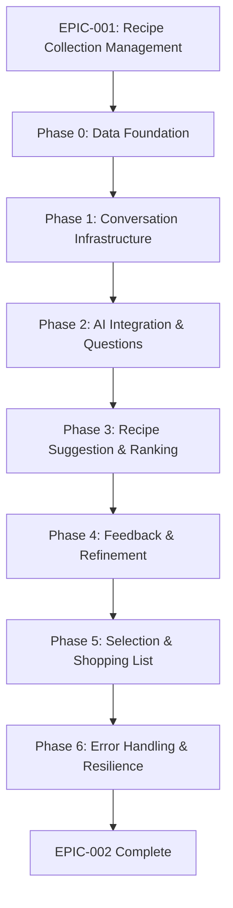

# MASTER Plan: Conversational Decision Support (EPIC-002)

## Executive Summary

This MASTER plan organizes the implementation of **EPIC-002: Conversational Decision Support**, the core value proposition of SimpleKitchen. This epic transforms the stressful question "What's for dinner?" into a confident answer through natural AI-powered conversation.

**Value Proposition**: Users engage in a supportive conversation that understands their context (energy level, time, mood, shopping capability), suggests 2-4 recipes matching their constraints, iteratively refines based on feedback, and concludes with a precise shopping list—all in under 10 minutes.

**Scope**: 7 user stories covering session initiation, contextual questions, recipe suggestions, feedback-driven refinement, and shopping list generation.

**Dependencies**: Requires **EPIC-001 (Recipe Collection Management)** to be complete, providing validated recipes with dietary constraints, time filtering, and ingredient data.

**Approach**: 7 phases (Phase 0-6) delivering incremental, testable functionality from data foundation through production-ready resilience.

---

## Input Documents

### Verified Inputs

- **Specification**: `thoughts/shared/specs/2025-12-25-SimpleKitchen.md`
  - System overview, data models, workflows
  - Mission capabilities 1, 2, 5, 7 (partial)
- **Epic Definition**: `thoughts/shared/epics/2025-12-25-Conversational-Decision-Support.md`
  - 7 user stories + 4 technical behaviors
  - Acceptance criteria (functional, technical, quality)
- **Research Report**: `thoughts/shared/research/2026-01-02-Conversational-Decision-Support.md`
  - Verified: Existing OpenAI GPT-4o-mini integration
  - Verified: IPC architecture supports async AI operations
  - Verified: Database DAL supports recipe filtering
  - Verified: Performance targets achievable (2-3s AI response)

### Key Research Findings (Verified)

1. **Existing OpenAI Integration** (`src/main/ai/recipe-generator.ts:126-135`): GPT-4o-mini with structured outputs (Zod schemas) already implemented. Extension, not greenfield.

2. **Performance Validated**: GPT-4o-mini achieves 2-3s response time for typical conversation turns (~$0.47 per 1,000 sessions). Meets <5s requirement.

3. **Database Ready**: Recipe DAL supports filtering by cookware, time, dietary tags, seasonality (`src/main/database/dal/recipes.ts:1-100`).

4. **IPC Pattern Established**: Async handlers with structured result types (`src/main/ipc/recipe-ai-handlers.ts:26-67`).

5. **Recommended UI Library**: `@chatscope/chat-ui-kit-react` (1.7k stars, active maintenance, production-ready).

6. **State Management Pattern**: Hybrid approach—XState for conversation flow + in-memory session state + SQLite for persistent history.

---

## Phase Breakdown

### Phase 0: Data Foundation & Schema

**Goal**: Establish database schema, TypeScript types, and dependencies before building features.

**Deliverables**:

- Database migration: Add `cooking_sessions` table with columns (id, recipe_id, timestamp, user_context, conversation_summary)
- TypeScript types: `ConversationSession`, `ConversationMessage`, `UserContext`, `RecipeSuggestion`
- Dependencies: Install `@chatscope/chat-ui-kit-react`, `@chatscope/chat-ui-kit-styles`
- Optional: Install `xstate` if state machine approach chosen

**Verification**:

- [ ] Migration runs successfully (`npm run db:migrate`)
- [ ] Types compile without errors (`npm run typecheck`)
- [ ] Dependencies installed and importable
- [ ] cooking_sessions table queryable in test suite

**Duration Estimate**: 2-3 days

---

### Phase 1: Conversation Infrastructure

**Goal**: Build the foundational conversation system—session management, basic UI, IPC wiring—without AI.

**Deliverables**:

- **Main Process**:
  - `src/main/conversation/session-manager.ts`: Create, track, cleanup sessions (in-memory Map)
  - `src/main/ipc/conversation-handlers.ts`: IPC handlers (start session, send message, abandon)
- **Renderer Process**:
  - `src/renderer/pages/ConversationPage.tsx`: Main conversation UI
  - `src/renderer/components/Conversation/MessageList.tsx`: Display messages
  - `src/renderer/components/Conversation/MessageInput.tsx`: User input field
  - `src/renderer/hooks/useConversation.ts`: Conversation state management (useReducer)

- **Shared Types**:
  - IPC contract types in `src/shared/types/conversation.ts`

**Verification**:

- [ ] User can click "What's for dinner?" to start session
- [ ] Session ID generated and tracked in session manager
- [ ] User can type message and send via IPC
- [ ] Message appears in UI (echo back for now, no AI)
- [ ] Session cleanup on page close
- [ ] Unit tests for session manager lifecycle
- [ ] Integration tests for IPC message flow

**User Stories Addressed**: Story 1 (Session Initiation—partial)

**Duration Estimate**: 5-7 days

---

### Phase 2: AI Integration & Contextual Questions

**Goal**: Integrate AI to generate contextual questions and capture user context (energy, time, mood).

**Deliverables**:

- **Main Process**:
  - `src/main/conversation/conversation-service.ts`: Orchestrates AI calls, manages conversation flow
  - `src/main/conversation/prompts.ts`: System prompts and user prompt builders
  - Extend OpenAI client usage to handle conversational turns (not just recipe generation)
  - Implement state machine (gathering → suggesting → refining → confirmed)

- **Renderer Process**:
  - Update ConversationPage to handle AI responses
  - Display contextual questions from AI
  - Capture user context (parse responses or structured input)

- **Prompting**:
  - System prompt for supportive, contextual question generation
  - User prompt includes current state and history (last 5-10 turns)

**Verification**:

- [ ] System asks opening question ("How's your energy level?")
- [ ] User responds with free text or quick-reply options
- [ ] System adapts follow-up question based on response
- [ ] User context captured in session state (energyLevel, availableTime, mood, canShop)
- [ ] Conversation state transitions (gathering → suggesting)
- [ ] AI response time <5 seconds
- [ ] Integration tests with mocked OpenAI responses
- [ ] Unit tests for prompt generation with various contexts

**User Stories Addressed**: Story 2 (Contextual Questions), Story 1 (Session Initiation—complete)

**Duration Estimate**: 7-10 days

---

### Phase 3: Recipe Suggestion & Ranking

**Goal**: Query recipes from database, rank with AI based on user context, display 2-4 suggestions.

**Deliverables**:

- **Main Process**:
  - `src/main/conversation/recipe-ranker.ts`: AI-powered recipe ranking logic
  - Query recipes from database (via existing DAL) filtered by:
    - Dietary constraints (from dietary_profile)
    - Time constraint (from user context)
    - Cookware type (one-pot/pan/oven)
  - Send candidate recipes + user context to AI for ranking
  - Receive ranked suggestions with reasoning

- **Renderer Process**:
  - `src/renderer/components/Conversation/RecipeSuggestionCard.tsx`: Display recipe cards within conversation
  - Show 2-4 recipes with title, time, cookware, brief ingredient summary

- **Prompting**:
  - System prompt for recipe ranking (considering energy, time, mood, seasonality)
  - Structured output schema (Zod) for ranked suggestions
  - Include reasoning for each suggestion

**Verification**:

- [ ] After gathering context, system queries recipes from database
- [ ] Recipes filtered by time, dietary constraints
- [ ] AI ranks top 3-4 recipes based on user context
- [ ] Recipe cards displayed in conversation with key details
- [ ] Suggestions feel relevant (energy level influences complexity)
- [ ] No recipes violate dietary constraints (100% enforcement)
- [ ] Recipe filtering completes in <1 second
- [ ] AI ranking completes in <5 seconds
- [ ] Unit tests for recipe ranking logic
- [ ] Integration tests for full suggestion flow

**User Stories Addressed**: Story 3 (Initial Suggestions)

**Duration Estimate**: 7-10 days

---

### Phase 4: Feedback & Iterative Refinement

**Goal**: Capture user feedback on suggestions, incorporate into refinement loop, avoid re-suggesting rejected recipes.

**Deliverables**:

- **Main Process**:
  - Track rejected recipes in session state (recipeId + reason)
  - Build refinement context for AI prompts (include rejected recipes, reasons)
  - Implement feedback handling (missing ingredient → suggest substitution)
  - Prevent re-suggesting rejected recipes

- **Renderer Process**:
  - Feedback UI: "Not this one" button with optional reason
  - Quick-reply buttons: "Missing ingredient", "Not in the mood", "Too complex"
  - Display AI refinement responses (substitution suggestions or new options)

- **Prompting**:
  - Inject rejected recipes into system prompt on subsequent turns
  - Identify patterns (e.g., all pasta rejected → user doesn't want pasta)
  - Suggest ingredient substitutions when applicable

**Verification**:

- [ ] User can reject a suggestion with reason
- [ ] Rejected recipe ID stored in session state
- [ ] Next suggestion turn does NOT include rejected recipes
- [ ] AI identifies rejection patterns (e.g., "I notice you rejected pasta dishes")
- [ ] AI suggests substitutions for missing ingredients
- [ ] Refinement loop works for 3+ cycles
- [ ] User can refine until satisfied or reaches turn limit
- [ ] Unit tests for rejection tracking
- [ ] Integration tests for refinement loop with feedback

**User Stories Addressed**: Story 4 (Feedback Handling), Story 5 (Iterative Refinement)

**Duration Estimate**: 7-10 days

---

### Phase 5: Selection & Shopping List

**Goal**: Handle recipe selection confirmation, generate shopping list, store cooking session in database.

**Deliverables**:

- **Main Process**:
  - Implement recipe selection confirmation handler
  - Generate shopping list (extract ingredients from selected recipe)
  - Store cooking session in `cooking_sessions` table (recipe_id, timestamp, user_context)
  - Return formatted shopping list to renderer

- **Renderer Process**:
  - "Select this recipe" button on suggestion cards
  - `src/renderer/pages/ShoppingListPage.tsx`: Display shopping list
  - Format: "2 tbsp olive oil", "1 lb chicken breast", etc.

- **Database**:
  - `src/main/database/dal/cooking-sessions.ts`: Create cooking session record
  - Link to selected recipe via foreign key

**Verification**:

- [ ] User can click "Select this recipe"
- [ ] Shopping list generated with accurate quantities and units
- [ ] Cooking session saved to database with timestamp and context
- [ ] Shopping list displayed in scannable format
- [ ] Full flow works end-to-end: initiation → context → suggestions → refinement → selection → shopping list
- [ ] Full session completes in <10 minutes (timed integration test)
- [ ] Shopping list generation completes in <2 seconds
- [ ] Database record persists across app restarts
- [ ] End-to-end tests for complete decision flow

**User Stories Addressed**: Story 6 (Selection Confirmation), Story 7 (Shopping List)

**Duration Estimate**: 5-7 days

---

### Phase 6: Error Handling & Resilience

**Goal**: Implement graceful degradation, conversation quality controls, edge case handling, performance optimization.

**Deliverables**:

- **Error Handling**:
  - AI service failure fallback (database filtering only, inform user)
  - Timeout handling (30s API timeout)
  - Retry logic (SDK already handles, verify behavior)

- **Conversation Quality Controls**:
  - Turn limits: Max 5 turns per state before escalation
  - Refinement caps: Max 3 rejection cycles before offering compromise
  - Session timeout: 30 minutes of inactivity
  - Escalation strategies: Suggest browsing, constraint relaxation, AI generation

- **Edge Cases**:
  - No recipes match constraints → Suggest relaxing time or offering AI generation
  - User abandons mid-conversation → Cleanup session state
  - All suggestions rejected → Offer compromise or broader search

- **Performance Optimization**:
  - Virtual scrolling for long message lists (if needed)
  - Optimistic UI updates (show user message immediately)
  - Caching strategy for repeated prompts (optional)

- **Accessibility**:
  - ARIA roles (`role="log"`, `aria-live="polite"`)
  - Keyboard navigation (Arrow keys, Home/End, Tab)

**Verification**:

- [ ] System handles AI service unavailable (shows database-filtered recipes with notice)
- [ ] System handles timeout gracefully (retry, then fallback)
- [ ] Conversation doesn't loop forever (turn limits enforced)
- [ ] After 3 rejections, system offers compromise
- [ ] Session cleanup on timeout (30 min inactivity)
- [ ] User perceives fast response (optimistic updates)
- [ ] Screen reader can navigate conversation
- [ ] Keyboard-only navigation works
- [ ] Error scenario tests (AI failure, timeout, no matches)
- [ ] Performance tests (conversation responsiveness <5s per turn)
- [ ] Load tests (100+ messages in conversation)

**Technical Behaviors Addressed**: All 4 technical behaviors (state management, prompting, graceful failure, ranking)

**Duration Estimate**: 7-10 days

---

## Phase Dependency Diagram

**Critical Path**: All phases are sequential except Phase 6, which can begin once Phase 5 MVP is working.

**Verification Gates**: Each phase has explicit acceptance criteria. Phase N+1 cannot start until Phase N verification is complete.

---

## Acceptance Criteria (Epic-Level)

The epic is complete when ALL of the following are true:

### Functional Criteria (User-Facing)

- [ ] User can initiate decision session with single action
- [ ] System asks contextual questions in natural, supportive tone
- [ ] System adapts questions based on user responses
- [ ] System suggests 2-4 recipes matching context and dietary constraints
- [ ] Suggestions feel relevant and thoughtful (not random)
- [ ] User can provide feedback on suggestions
- [ ] System refines based on feedback (no re-suggesting rejected recipes)
- [ ] User can confirm recipe selection
- [ ] Shopping list generated with accurate quantities and units
- [ ] Full decision session completes in <10 minutes
- [ ] Conversation feels supportive, not interrogative

### Technical Criteria (System-Level)

- [ ] Conversation Context entity exists and manages state
- [ ] AI Service Integration sends prompts and parses responses
- [ ] Decision Support Engine queries and ranks recipes
- [ ] Ingredient Analysis extracts shopping list
- [ ] System handles AI failures gracefully (fallback to database filtering)
- [ ] Conversation state maintained across multiple turns
- [ ] cooking_sessions table stores completed decisions

### Quality Criteria (Testing/Verification)

- [ ] Integration tests cover full decision flow
- [ ] Suggestions respect dietary constraints (100% enforcement)
- [ ] Suggestions respect time constraints (30-60 minutes)
- [ ] Unit tests for ranking logic with various contexts
- [ ] Performance tests confirm <5s conversation turns
- [ ] User acceptance testing confirms supportive tone and relevance

**Success Metric**: 90% of users find a recipe they're excited to cook within 10 minutes (future user testing).

---

## Architectural Decisions

### Already Decided (Verified from Research)

| Decision                                                                 | Rationale                                             | Evidence               |
| ------------------------------------------------------------------------ | ----------------------------------------------------- | ---------------------- |
| **AI Service**: GPT-4o-mini                                              | Already integrated, meets performance/cost targets    | Research lines 51-89   |
| **UI Library**: @chatscope/chat-ui-kit-react                             | Production-ready, 1.7k stars, active maintenance      | Research lines 341-416 |
| **State Management**: useReducer (renderer) + in-memory Map (main)       | React best practice for complex state, simple cleanup | Research lines 419-442 |
| **Database**: SQLite with cooking_sessions table                         | Existing pattern, local persistence                   | Research lines 217-227 |
| **Architecture**: Main process (AI+DB), Renderer (UI), IPC communication | Existing pattern, security boundary                   | Research lines 671-712 |
| **Prompting**: Structured outputs with Zod schemas                       | Already used for recipe generation                    | Research lines 233-298 |
| **Error Handling**: Graceful degradation to database filtering           | Existing pattern in recipe-generator.ts               | Research lines 547-578 |

### To Be Decided in Detailed Planning

- Whether to use XState for state machine or simpler state enum
- Specific prompt templates and few-shot examples
- Exact turn limits (5?) and escalation thresholds (3 rejections?)
- Session timeout duration (30 minutes?)
- Whether to implement streaming responses (Phase 6 optimization)
- Caching strategy for repeated prompts (if needed for performance)
- Specific accessibility enhancements beyond basic ARIA

### Explicitly Deferred (Not in MVP)

- Session persistence across app restarts (research recommends ephemeral)
- Conversation summarization for long sessions (unlikely to exceed token limits)
- Multi-day shopping list persistence (separate feature request)
- Advanced ingredient substitution engine (AI handles basic cases)
- Implicit feedback tracking (EPIC-003 handles explicit history only)
- Conversation analytics or metrics dashboard
- Voice input/output

---

## Risk Register

### Technical Risks

| Risk                            | Impact                           | Probability | Mitigation                                                                      |
| ------------------------------- | -------------------------------- | ----------- | ------------------------------------------------------------------------------- |
| **AI latency exceeds 5s**       | High (UX degradation)            | Medium      | Optimize prompts, implement caching, use streaming for perceived speed          |
| **Conversation feels random**   | High (core value lost)           | Medium      | Extensive prompt engineering, few-shot examples, user feedback loop in Phase 4  |
| **State management complexity** | Medium (bugs, hard to debug)     | Medium      | Use proven patterns (XState or simple enum), comprehensive tests                |
| **EPIC-001 integration gaps**   | High (blocking)                  | Low         | Verify EPIC-001 completion includes all required query patterns before starting |
| **Memory leaks from sessions**  | Medium (performance degradation) | Low         | Session timeout, cleanup on abandonment, load tests in Phase 6                  |

### User Experience Risks

| Risk                                | Impact                      | Probability | Mitigation                                                               |
| ----------------------------------- | --------------------------- | ----------- | ------------------------------------------------------------------------ |
| **User stuck in conversation loop** | High (frustration)          | Medium      | Turn limits (5 per state), escalation strategies (Phase 6)               |
| **Too many questions/choices**      | Medium (cognitive overload) | Low         | Limit to 2-4 suggestions, one question at a time (enforced in prompts)   |
| **Context loss on return**          | Low (minor annoyance)       | Medium      | Start with ephemeral sessions, add persistence only if needed (deferred) |

### Performance Risks

| Risk                    | Impact                     | Probability | Mitigation                                                     |
| ----------------------- | -------------------------- | ----------- | -------------------------------------------------------------- |
| **Database query slow** | Medium (missed <1s target) | Low         | Research verified achievable; add indexes if needed in Phase 6 |
| **OpenAI rate limits**  | High (service unavailable) | Low         | SDK handles retries; fallback to database filtering (Phase 6)  |

---

## Deferred Features (Explicit Non-MVP)

The following are **intentionally excluded** from this epic and may be addressed in future work:

1. **Session Persistence Across Restarts**: Conversations do not resume after app close. Research recommends starting ephemeral for simplicity.

2. **Conversation Summarization**: For sessions exceeding 4,000 tokens. Research indicates typical sessions stay under limit.

3. **Multi-Day Shopping List Persistence**: Shopping lists are ephemeral. If user needs it later, regenerate from recipe.

4. **Advanced Ingredient Substitution Engine**: AI handles basic substitutions via natural language. No separate substitution database.

5. **Implicit Feedback Tracking**: Only track explicit cooking decisions (EPIC-003). Do not track "recipes suggested but not cooked."

6. **Conversation Analytics**: No metrics dashboard for conversation quality, turn counts, etc.

7. **Voice Input/Output**: Text-only conversation for MVP.

8. **Streaming Responses**: Use standard request/response pattern. Streaming is Phase 6 optimization if needed.

9. **Conversation History Browsing**: Cannot view past conversations. Only cooking history (EPIC-003).

10. **Multi-Language Support**: English-only prompts and UI.

---

## Testing Strategy

### Phase-Specific Testing

| Phase   | Test Focus                                  | Tools/Approach                                          |
| ------- | ------------------------------------------- | ------------------------------------------------------- |
| Phase 0 | Database migration, type checking           | Vitest (migration tests), TypeScript compiler           |
| Phase 1 | IPC integration, UI components              | Vitest (unit), Playwright (E2E for UI)                  |
| Phase 2 | AI integration (mocked), prompt validation  | Vitest (mocked OpenAI), manual prompt testing           |
| Phase 3 | Recipe ranking logic, suggestion quality    | Vitest (unit tests), manual UX review                   |
| Phase 4 | Refinement loop, feedback incorporation     | Vitest (integration tests), E2E flow tests              |
| Phase 5 | End-to-end flow, shopping list accuracy     | Playwright (full user journey), timing tests            |
| Phase 6 | Error scenarios, performance, accessibility | Vitest (error injection), Lighthouse (a11y), load tests |

### Quality Gates

Each phase must pass:

- [ ] All unit tests passing (`npm test`)
- [ ] All integration tests passing
- [ ] Type checking without errors (`npm run typecheck`)
- [ ] Linting without errors (`npm run lint`)
- [ ] Manual verification of acceptance criteria

Before EPIC-002 completion:

- [ ] End-to-end tests for full decision flow
- [ ] Performance tests confirm <5s per turn, <10 min total session
- [ ] Accessibility audit (ARIA roles, keyboard navigation)
- [ ] User acceptance testing (qualitative: supportive tone, relevant suggestions)

---

## Next Steps

### For the Planner (This Agent)

After MASTER plan approval:

1. **Verify EPIC-001 Completion**: Read EPIC-001 STATE file to confirm recipe database, validation, and filtering are complete.

2. **Create Phase 0 Detailed Plan**:
   - File: `2026-01-02-Conversational-Decision-Support-Phase0-STATE.md`
   - Include: Database migration SQL, TypeScript type definitions, dependency installation steps
   - Evidence: Cite existing database schema, existing type patterns

3. **Create Phase 1 Detailed Plan**:
   - File: `2026-01-02-Conversational-Decision-Support-Phase1-STATE.md`
   - Include: Session manager implementation, IPC handlers, UI components, acceptance tests
   - Evidence: Cite existing IPC handler patterns, existing UI component structure

4. **Repeat for Phases 2-6**: Each phase gets a detailed plan with:
   - Action items (PLAN-XXX)
   - File paths and line ranges
   - Pseudocode/interfaces
   - Verification steps
   - Evidence from research and existing code

### For the Implementor (Future Agent)

When executing each phase:

1. Read the detailed phase plan
2. Verify all prerequisites from previous phase
3. Implement action items in sequence
4. Run tests after each action
5. Update phase STATE file with progress
6. Notify Planner when phase is complete for verification

### For the User

After reviewing this MASTER plan:

1. **Approve or request changes**: Does the phase breakdown make sense? Any missing concerns?

2. **Confirm EPIC-001 status**: Is Recipe Collection Management complete and verified?

3. **Proceed to Phase 0**: Once approved, the Planner will create the detailed Phase 0 plan for data foundation.

---

## Appendix: Key References

### Spec References

- **Conversational Interface Component**: Spec lines 82-94
- **Decision Support Engine Component**: Spec lines 96-110
- **AI Service Integration Component**: Spec lines 167-172
- **Ingredient Analysis Component**: Spec lines 157-161
- **Conversation Context Entity**: Spec lines 491-505
- **Workflow 1: Daily Decision Conversation**: Spec lines 200-251

### Epic References

- **User Stories**: Epic lines 41-77
- **System Behaviors**: Epic lines 79-91
- **Acceptance Criteria**: Epic lines 120-157
- **Suggested Phases**: Epic lines 220-260
- **Dependencies**: Epic lines 160-178

### Research References

- **Finding 1: Existing OpenAI Integration**: Research lines 51-74
- **Finding 2: Performance Validated**: Research lines 76-89
- **Finding 3: Error Handling Pattern**: Research lines 91-106
- **Finding 4: Database Filtering**: Research lines 108-116
- **Finding 5: IPC Architecture**: Research lines 118-141
- **Conversation State Management**: Research lines 162-228
- **Prompting Strategies**: Research lines 230-298
- **Iterative Refinement Pattern**: Research lines 302-329
- **UI Architecture**: Research lines 331-442
- **Architecture Recommendations**: Research lines 671-831

### Codebase References (Verified)

- OpenAI client initialization: `src/main/ai/recipe-generator.ts:23-30`
- Structured output usage: `src/main/ai/recipe-generator.ts:126-135`
- Error handling pattern: `src/main/ai/recipe-generator.ts:174-228`
- IPC handler pattern: `src/main/ipc/recipe-ai-handlers.ts:26-67`
- Recipe DAL: `src/main/database/dal/recipes.ts:1-100`
- Dietary profile table: `src/shared/types/database.ts:61-69`

---

**End of MASTER Plan**

**Status**: Awaiting user approval to proceed with detailed Phase 0 planning.

**Next Document**: `2026-01-02-Conversational-Decision-Support-Phase0-Data-Foundation.md` (after approval)
