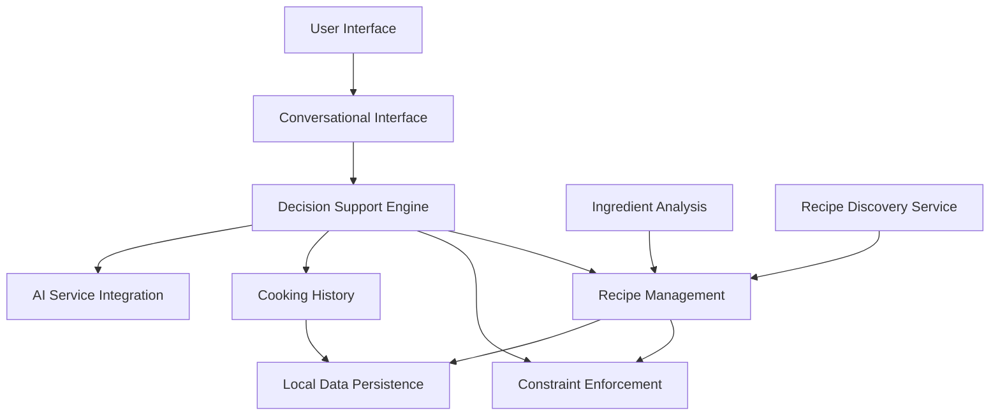
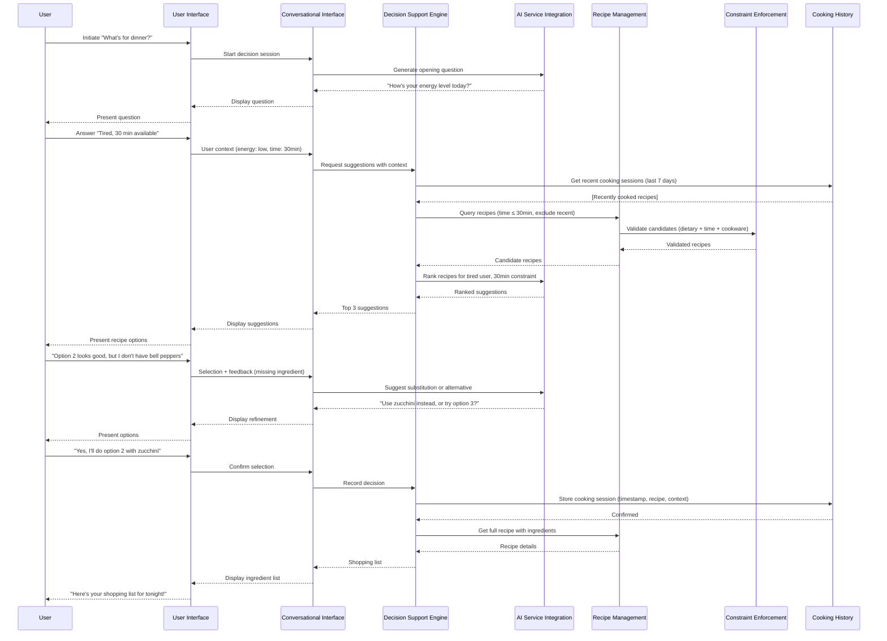
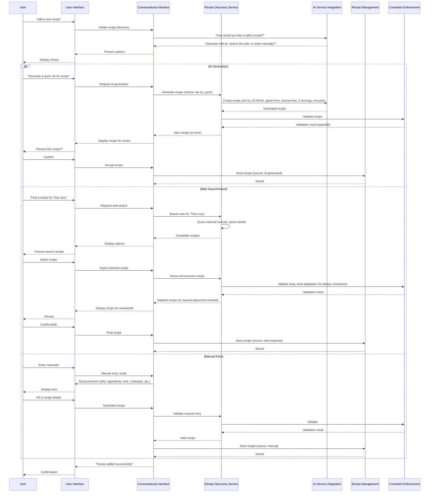
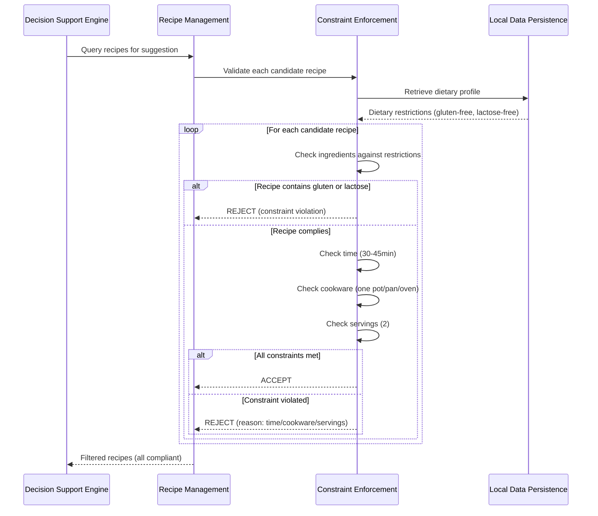
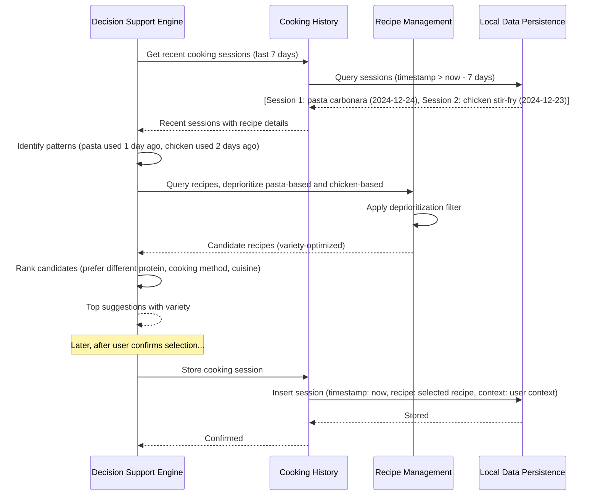
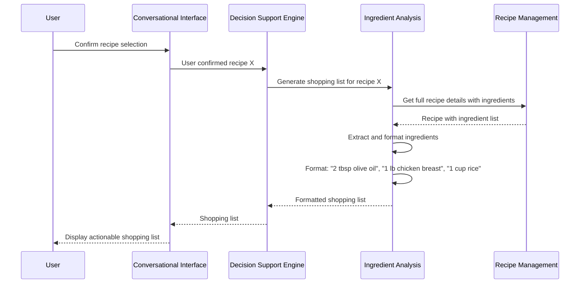
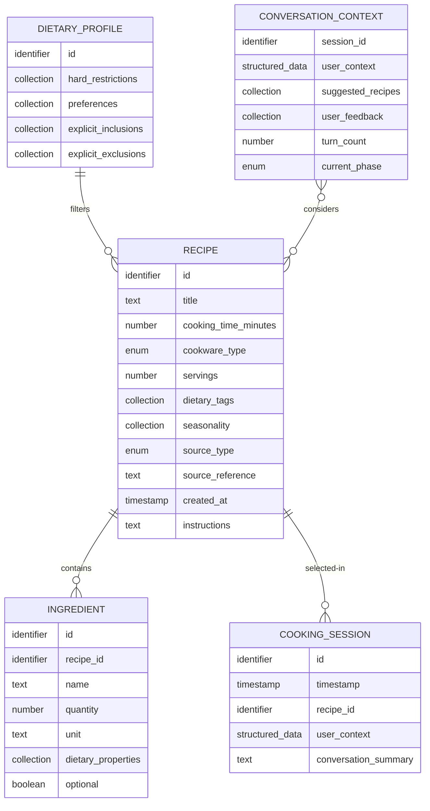
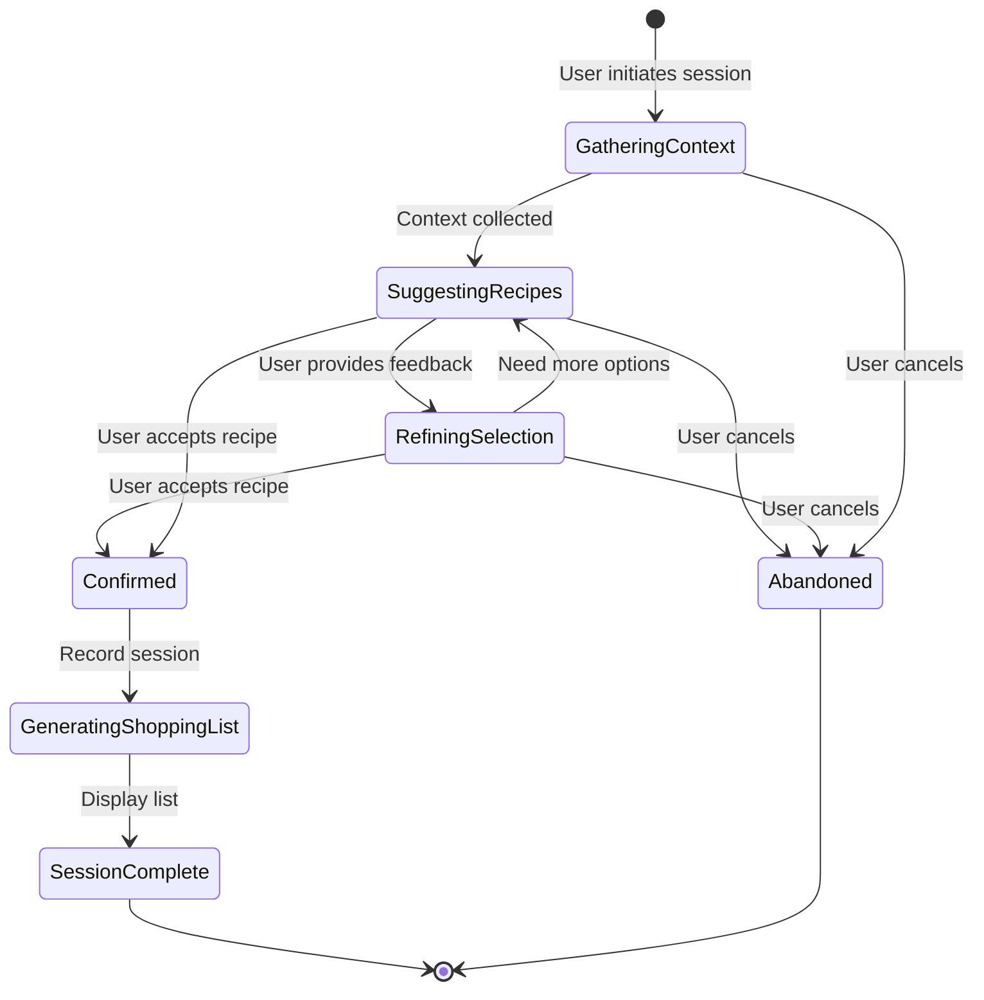
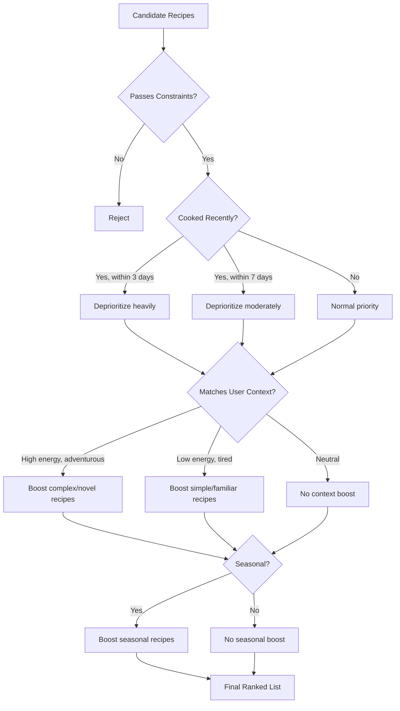

# Specification: SimpleKitchen

## Mission Reference

**Source**: `thoughts/shared/missions/2025-12-25-SimpleKitchen.md`

**Core Value Proposition** (from mission):
SimpleKitchen lifts the cognitive load of deciding what to cook on busy weeknights, replacing decision fatigue and uncertainty with confidence and excitement through AI-powered conversational decision support.

**Essential Capabilities** (from mission):
1. AI-Powered Conversational Decision Support
2. Intelligent Recipe Suggestion Engine
3. Multi-Modal Recipe Discovery and Storage
4. Dietary Constraint Enforcement
5. Precise Ingredient List Generation
6. Cooking History Tracking
7. Context-Aware Filtering (Time, Method, Servings)

## System Overview

SimpleKitchen is an intelligent cooking companion that transforms the stressful question "What's for dinner?" into a confident answer through natural conversation. The system engages busy professionals at the end of their workday, understands their current context (energy level, available time, shopping capability), and iteratively refines recipe suggestions until the user finds a meal they genuinely want to cook. Once a choice is made, it provides an exact shopping list, enabling a quick stop at the store on the way home.

The system maintains awareness of the user's cooking history to promote variety, enforces hard dietary constraints (gluten-free, lactose-free) to ensure safety, and respects practical limitations (30-45 minute cooking time, minimal cookware) to make home cooking achievable on weeknights.

Unlike traditional recipe databases or meal planning applications, SimpleKitchen focuses exclusively on just-in-time decision support through adaptive conversation, not advance planning or cooking instruction.

**Key Responsibilities**:
- Conduct contextual conversations to understand user needs and refine recipe suggestions iteratively
- Maintain a growing collection of recipes acquired through AI generation, web import, or manual entry
- Filter and suggest recipes based on dietary restrictions, time constraints, cookware limitations, and cooking history
- Generate precise ingredient lists for immediate shopping
- Track cooking decisions to promote variety and avoid repetition

**System Boundaries**:
- **In Scope**: 
  - Same-day dinner decision support through conversational AI
  - Recipe storage, filtering, and intelligent suggestion
  - Dietary constraint enforcement (gluten-free, lactose-free)
  - Time and cookware constraint enforcement (30-45 minutes, one pot/pan/oven)
  - Cooking history tracking for variety promotion
  - Multi-modal recipe acquisition (AI generation, web search/import, manual entry)
  - Ingredient list generation for shopping
  
- **Out of Scope** (from mission's non-goals):
  - Weekly meal planning or calendar-based scheduling
  - Meal prep or batch cooking guidance
  - Nutrition tracking, calorie counting, or macro analysis
  - Step-by-step cooking instruction, timers, or technique tutorials
  - Social features, recipe sharing, or user communities
  - Smart kitchen device integration (IoT)
  - Multi-user support or cloud synchronization
  - Recipe rating or review systems

## Architecture (Conceptual)

### High-Level Components



**Component: Conversational Interface**
- **Purpose**: Orchestrates natural language dialogue between user and system
- **Responsibilities**:
  - Present contextual questions to gather user state (mood, energy, time, shopping capability)
  - Display recipe suggestions from the Decision Support Engine
  - Capture user feedback on suggestions (accept, reject, refine)
  - Facilitate iterative refinement until user accepts a recipe
  - Handle recipe discovery workflows (AI generation, web search, manual entry)
- **Interactions**: 
  - Receives user input from User Interface
  - Sends conversation context to Decision Support Engine
  - Invokes AI Service Integration for natural language understanding and generation
  - Displays results to User Interface

**Component: Decision Support Engine**
- **Purpose**: Core orchestration logic that drives recipe selection based on user context and constraints
- **Responsibilities**:
  - Interpret user context (energy level, time availability, mood) to filter candidate recipes
  - Query Recipe Management for recipes matching constraints
  - Apply Constraint Enforcement rules (dietary, time, cookware, servings)
  - Consult Cooking History to promote variety and avoid recent repetition
  - Rank and select recipes for suggestion based on seasonality, variety, and user feedback
  - Handle fallback strategies when no suitable recipe is found (suggest constraint relaxation, offer AI generation)
- **Interactions**:
  - Receives conversation context from Conversational Interface
  - Queries Recipe Management for candidate recipes
  - Validates candidates through Constraint Enforcement
  - Retrieves recent cooking sessions from Cooking History
  - Returns ranked suggestions to Conversational Interface

**Component: Recipe Management**
- **Purpose**: Central repository for all recipes, supporting storage, retrieval, and filtering
- **Responsibilities**:
  - Store recipes with full metadata (ingredients, cooking time, cookware type, dietary tags, servings, seasonality, source)
  - Retrieve recipes based on filter criteria (dietary restrictions, time range, cookware type, servings)
  - Support multi-modal recipe acquisition (AI-generated, web-imported, manually entered)
  - Maintain recipe-ingredient relationships
  - Provide search and filtering interfaces for the Decision Support Engine
- **Interactions**:
  - Receives queries from Decision Support Engine
  - Stores and retrieves data via Local Data Persistence
  - Receives new recipes from Recipe Discovery Service
  - Validates recipes through Constraint Enforcement before storage

**Component: Constraint Enforcement**
- **Purpose**: Ensures all recipes and suggestions comply with hard constraints (dietary, time, cookware, servings)
- **Responsibilities**:
  - Validate recipes against dietary restrictions (gluten-free, lactose-free)
  - Verify cooking time constraints (30-45 minutes)
  - Verify cookware requirements (one pot, one pan, or oven-based)
  - Verify servings (2 people)
  - Reject or flag recipes that violate constraints
  - Support dietary profile customization (explicit inclusions/exclusions)
- **Interactions**:
  - Receives validation requests from Recipe Management and Decision Support Engine
  - Queries dietary profile from Local Data Persistence
  - Returns validation results (pass/fail with reasons)

**Component: Cooking History**
- **Purpose**: Tracks past cooking decisions to inform future suggestions and promote variety
- **Responsibilities**:
  - Record each cooking session (timestamp, selected recipe, user context)
  - Retrieve recent cooking sessions for variety analysis
  - Identify patterns (e.g., frequently cooked recipes, recent ingredient types, cooking methods)
  - Support queries like "what was cooked in the last N days?"
- **Interactions**:
  - Receives session recording requests from Decision Support Engine
  - Stores data via Local Data Persistence
  - Provides history queries to Decision Support Engine

**Component: Ingredient Analysis**
- **Purpose**: Generates precise, actionable shopping lists from selected recipes
- **Responsibilities**:
  - Extract ingredient list from a selected recipe
  - Format ingredients for shopping (quantity, unit, item name)
  - Optionally support ingredient substitution suggestions (during conversation)
- **Interactions**:
  - Receives recipe reference from Decision Support Engine
  - Queries Recipe Management for full ingredient details
  - Returns formatted shopping list to Conversational Interface

**Component: AI Service Integration**
- **Purpose**: Interface to external AI services for natural language processing and recipe generation
- **Responsibilities**:
  - Send conversation prompts with user context, recipe database context, and constraints
  - Receive AI-generated suggestions, conversation responses, or newly created recipes
  - Handle API errors and fallback gracefully
- **Interactions**:
  - Receives requests from Conversational Interface and Recipe Discovery Service
  - Communicates with external AI services (network dependency)
  - Returns AI responses to calling components

**Component: Recipe Discovery Service**
- **Purpose**: Facilitates acquisition of new recipes through AI generation, web search, or manual entry
- **Responsibilities**:
  - Generate new recipes via AI based on user criteria (ingredients, cooking method, time, dietary constraints)
  - Search and parse external recipe sources (web scraping or API integration)
  - Guide user through manual recipe entry with structured input
  - Validate discovered recipes against constraints before adding to Recipe Management
- **Interactions**:
  - Invokes AI Service Integration for recipe generation
  - Interacts with external web sources for recipe import
  - Submits new recipes to Recipe Management
  - Validates via Constraint Enforcement

**Component: Local Data Persistence**
- **Purpose**: Durable storage for all user data (recipes, cooking sessions, dietary profile)
- **Responsibilities**:
  - Persist recipes, ingredients, cooking sessions, and dietary preferences
  - Provide transactional data access to ensure consistency
  - Support efficient querying and filtering
  - Ensure data durability and recovery
- **Interactions**:
  - Receives storage and retrieval requests from Recipe Management, Cooking History, and Constraint Enforcement
  - Stores data locally on the user's machine (no cloud sync)

### Data Flow (Key Workflows)

**Workflow 1: AI-Powered Conversational Decision Support**



This workflow satisfies **Capability 1 (Conversational Decision Support)** and **Capability 2 (Intelligent Recipe Suggestion)**.

**Workflow 2: Multi-Modal Recipe Discovery and Storage**



This workflow satisfies **Capability 3 (Multi-Modal Recipe Discovery and Storage)**.

**Workflow 3: Dietary Constraint Enforcement**



This workflow satisfies **Capability 4 (Dietary Constraint Enforcement)** and **Capability 7 (Context-Aware Filtering)**.

**Workflow 4: Cooking History Tracking and Variety Promotion**



This workflow satisfies **Capability 6 (Cooking History Tracking)**.

**Workflow 5: Precise Ingredient List Generation**



This workflow satisfies **Capability 5 (Precise Ingredient List Generation)**.

## Data Model (Abstract)

### Entity: Recipe

**Purpose**: Represents a single cookable meal with all necessary information for decision-making, cooking, and constraint validation

**Attributes** (conceptual):
- **Unique Identifier**: System-generated, immutable
- **Title**: Short text description of the dish
- **Cooking Time**: Numeric value representing active cooking time in minutes
- **Cookware Type**: One of a predefined set (one-pot, one-pan, oven-based)
- **Servings**: Numeric value (constrained to 2 for this system)
- **Dietary Tags**: Collection of dietary attributes (gluten-free, lactose-free, vegan, etc.)
- **Seasonality**: Collection of seasons when the recipe is most appropriate (spring, summer, fall, winter, any)
- **Source Type**: How the recipe was acquired (AI-generated, web-imported, manual)
- **Source Reference**: Original URL or reference if web-imported, null otherwise
- **Created Timestamp**: When the recipe was added to the system
- **Ingredient List**: Collection of ingredients with quantities and units (see Ingredient entity)
- **Instructions**: Optional text field (user is experienced, may not need detailed steps)

**Relationships**:
- A Recipe has many Ingredients (one-to-many)
- A Recipe is referenced by zero or many Cooking Sessions (one-to-many)

### Entity: Ingredient

**Purpose**: Represents a single ingredient within a recipe with quantity and dietary properties

**Attributes** (conceptual):
- **Unique Identifier**: System-generated, immutable
- **Recipe Reference**: Reference to the parent Recipe
- **Name**: Text name of the ingredient (e.g., "olive oil", "chicken breast", "bell pepper")
- **Quantity**: Numeric value (e.g., 2, 1.5, 0.25)
- **Unit**: Text unit of measurement (e.g., "tbsp", "lb", "cup", "whole")
- **Dietary Properties**: Collection of dietary attributes derived from ingredient knowledge (contains-gluten, contains-lactose, etc.)
- **Optional Flag**: Boolean indicating if the ingredient is optional

**Relationships**:
- An Ingredient belongs to exactly one Recipe (many-to-one)

### Entity: Cooking Session

**Purpose**: Records a single instance of the user selecting and committing to cook a recipe, enabling history tracking and variety promotion

**Attributes** (conceptual):
- **Unique Identifier**: System-generated, immutable
- **Timestamp**: When the decision was made (date and time)
- **Recipe Reference**: Reference to the Recipe that was selected
- **User Context**: Structured data capturing the user's state at decision time (energy level, available time, mood descriptors)
- **Conversation Summary**: Optional text field summarizing the conversation that led to this decision

**Relationships**:
- A Cooking Session references exactly one Recipe (many-to-one)

### Entity: Dietary Profile

**Purpose**: Stores the user's hard dietary constraints and preferences to enforce safe recipe filtering

**Attributes** (conceptual):
- **Unique Identifier**: System-generated (single profile for single-user system)
- **Hard Restrictions**: Collection of dietary constraints that must never be violated (e.g., gluten-free, lactose-free)
- **Preferences**: Collection of dietary preferences that influence ranking but are not hard constraints (e.g., prefers-vegetarian)
- **Explicit Inclusions**: Collection of ingredients or food categories explicitly allowed despite potential ambiguity (e.g., "hard cheese allowed despite lactose-free")
- **Explicit Exclusions**: Collection of ingredients or food categories explicitly excluded (e.g., "no mushrooms")

**Relationships**:
- A Dietary Profile applies to all Recipes (one-to-many, conceptual filter relationship)
- A Dietary Profile is queried by Constraint Enforcement

### Entity: Conversation Context (Ephemeral)

**Purpose**: Maintains state during an active decision session to support iterative refinement

**Attributes** (conceptual):
- **Session Identifier**: Temporary identifier for the active conversation
- **User Context**: Current user state (energy, time, mood, shopping capability)
- **Suggested Recipes**: Collection of recipes already suggested in this session
- **User Feedback**: Collection of user reactions to suggestions (accepted, rejected, reasons for rejection)
- **Conversation Turn Count**: Number of exchanges in this session
- **Current Phase**: Where in the decision workflow (gathering context, suggesting recipes, refining, confirmed)

**Relationships**:
- A Conversation Context references multiple Recipes (candidates and suggestions)
- A Conversation Context is ephemeral and does not persist after session completion

### Entity Relationship Diagram



## External Interfaces (Abstract Contracts)

### User Interface Contract

**Interactions**:

- **Initiate Decision Session**: User triggers "What's for dinner?" → System responds with opening question about user's current state
- **Answer Context Questions**: System asks about energy/mood/time/shopping → User provides free-form or structured response → System acknowledges and adapts
- **Review Recipe Suggestions**: System presents 2-4 recipe options with key details (title, time, cookware, ingredients summary) → User reacts (accept, reject, provide feedback)
- **Provide Feedback on Suggestions**: User explains why a suggestion doesn't work (missing ingredient, not in the mood, too complex) → System refines and suggests alternatives
- **Confirm Recipe Selection**: User accepts a recipe → System displays full details and generates shopping list
- **View Shopping List**: System presents ingredient list formatted for shopping → User can copy, print, or view on mobile
- **Add New Recipe**: User requests to add recipe → System guides through discovery mode (AI generation, web search, manual entry)
- **View Cooking History**: User requests past cooking choices → System displays recent sessions with dates and recipes

**Key Views/Screens** (conceptual):

- **Decision Session View**: Conversational interface with message history, current question, and recipe cards for suggestions
- **Recipe Detail View**: Full recipe information (title, time, cookware, servings, ingredients with quantities, optional instructions)
- **Shopping List View**: Simple, scannable list of ingredients with quantities and units
- **Recipe Discovery View**: Multi-modal interface supporting AI generation prompts, web search input, or structured manual entry form
- **History View**: Chronological list of past cooking sessions with dates, recipe names, and user context

### External System Interfaces

**Integration: AI Service (e.g., LLM API)**

- **Purpose**: Provide natural language understanding, conversation generation, recipe suggestion ranking, and AI-based recipe creation
- **Data Exchange**:
  - **Outbound**: Conversation context (user messages, system state, recipe database context, constraints)
  - **Inbound**: AI-generated responses (questions, suggestions, ranked recipes, newly created recipes)
- **Trigger**: User interaction requiring natural language processing or recipe generation
- **Error Handling**: If AI service unavailable, system falls back to simpler rule-based filtering and presents recipes without conversational refinement

**Integration: Web Recipe Sources (Optional)**

- **Purpose**: Enable discovery and import of recipes from external websites or APIs
- **Data Exchange**:
  - **Outbound**: Search query (e.g., "Thai curry recipes")
  - **Inbound**: Recipe data (title, ingredients, cooking time, instructions, source URL)
- **Trigger**: User initiates web search for recipe discovery
- **Error Handling**: If web source unavailable, inform user and suggest AI generation or manual entry as alternatives

### API Contract (Internal - Between Components)

**Operation: Request Recipe Suggestions**

- **Caller**: Conversational Interface
- **Receiver**: Decision Support Engine
- **Input**:
  - User context (energy level, available time, mood descriptors, shopping capability)
  - Conversation history (optional, for context continuity)
  - Number of suggestions requested
- **Output**:
  - Collection of Recipe entities (typically 2-4) ranked by relevance
  - Ranking rationale (optional, for conversational explanation)
- **Behavior**:
  - Queries Recipe Management for candidates matching time and dietary constraints
  - Consults Cooking History to exclude or deprioritize recently cooked recipes
  - Ranks candidates based on user context, seasonality, and variety
  - Returns top N suggestions
- **Error Conditions**:
  - No recipes match constraints → Return empty collection with suggestion to relax constraints or generate new recipe
  - User context incomplete → Request clarification from Conversational Interface

**Operation: Validate Recipe Against Constraints**

- **Caller**: Recipe Management, Recipe Discovery Service
- **Receiver**: Constraint Enforcement
- **Input**:
  - Recipe entity with full details (ingredients, cooking time, cookware, servings)
- **Output**:
  - Validation result (pass/fail)
  - Collection of constraint violations (if any) with descriptions
- **Behavior**:
  - Retrieves Dietary Profile
  - Checks each ingredient for dietary violations (gluten, lactose, explicit exclusions)
  - Verifies cooking time is within 30-45 minutes
  - Verifies cookware is one-pot, one-pan, or oven-based
  - Verifies servings equals 2
  - Returns pass if all constraints met, fail otherwise with reasons
- **Error Conditions**:
  - Dietary Profile not configured → Assume default strict restrictions (gluten-free, lactose-free)
  - Ingredient dietary data missing → Flag for manual review

**Operation: Store Cooking Session**

- **Caller**: Decision Support Engine
- **Receiver**: Cooking History
- **Input**:
  - Timestamp (when decision was made)
  - Recipe reference (selected recipe)
  - User context (energy, time, mood captured during conversation)
  - Conversation summary (optional)
- **Output**:
  - Confirmation (success/failure)
  - Session identifier (for reference)
- **Behavior**:
  - Persists cooking session to Local Data Persistence
  - Links session to selected Recipe
  - Returns confirmation
- **Error Conditions**:
  - Recipe reference invalid → Reject and return error
  - Persistence failure → Retry and log error

**Operation: Generate Shopping List**

- **Caller**: Decision Support Engine
- **Receiver**: Ingredient Analysis
- **Input**:
  - Recipe reference (selected recipe)
- **Output**:
  - Formatted ingredient list (collection of strings like "2 tbsp olive oil", "1 lb chicken breast")
- **Behavior**:
  - Retrieves full Recipe entity from Recipe Management
  - Extracts Ingredient collection
  - Formats each ingredient as "quantity unit name"
  - Returns formatted list
- **Error Conditions**:
  - Recipe reference invalid → Return error
  - Ingredient data incomplete → Return partial list with warning

## Non-Functional Requirements

### Performance

- **Conversation Responsiveness**: Each conversational turn (user input → system response) must complete in <5 seconds to maintain natural flow
- **Recipe Filtering**: Recipe querying and filtering must complete in <1 second even with a collection of 1000+ recipes
- **Shopping List Generation**: Ingredient list generation must complete in <2 seconds
- **Overall Decision Time**: User must achieve decision confidence (from session start to shopping list) in <10 minutes (mission success criterion)

### Scalability

- **Single User**: System is designed for one user; no concurrent user load considerations
- **Recipe Collection Growth**: System must handle recipe collections growing to thousands of recipes without performance degradation
- **History Accumulation**: Cooking history may accumulate hundreds of sessions over months/years; history queries must remain fast (<1 second)

### Reliability

- **Data Durability**: All user data (recipes, cooking sessions, dietary profile) must be stored durably with no data loss on application restart
- **AI Service Resilience**: System must degrade gracefully if AI service is unavailable (fall back to simpler filtering, inform user of limited functionality)
- **Dietary Constraint Enforcement**: Constraint validation must be 100% reliable with zero false negatives (never suggest a recipe violating dietary restrictions)

### Security

- **Local Execution**: Application runs locally on user's machine; no cloud storage or external data synchronization (per mission constraint)
- **Data Privacy**: User's recipe collection, cooking history, and dietary profile remain private and local; no external sharing

### Usability

- **Conversational Tone**: AI-generated questions and responses must feel natural, supportive, and non-judgmental (not interrogative or robotic)
- **Suggestion Intelligence**: Recipe suggestions must feel relevant and thoughtful, not random (user must perceive that the system "understands" them)
- **Actionable Shopping Lists**: Ingredient lists must be precise, scannable, and ready for immediate use at the grocery store
- **Error Messaging**: When constraints cannot be met, system must offer constructive alternatives (e.g., "relax time constraint to 50 minutes?" or "generate a custom recipe?")

## Acceptance Criteria (Spec-Level)

For each essential capability from the mission, the following conditions define successful implementation:

**Capability 1: AI-Powered Conversational Decision Support**
- [ ] User can initiate a decision session with a simple trigger ("What's for dinner?")
- [ ] System asks contextual questions about user's current state (mood, energy, time, shopping capability)
- [ ] System adapts follow-up questions based on user responses (e.g., if user says "low energy," system prioritizes simple recipes)
- [ ] User can provide feedback on suggestions and system refines iteratively (e.g., "I don't have X ingredient" → system suggests substitution or alternative recipe)
- [ ] Conversation concludes when user accepts a recipe or explicitly ends the session
- [ ] Entire conversation from start to shopping list takes <10 minutes

**Capability 2: Intelligent Recipe Suggestion Engine**
- [ ] System suggests 2-4 recipes based on user context (not random selection)
- [ ] Suggestions respect variety (do not suggest recipes similar to those cooked in the last 3 days)
- [ ] Suggestions consider seasonality (prefer seasonal ingredients when applicable)
- [ ] Suggestions adapt to user feedback within the session (if user rejects pasta, don't suggest another pasta dish)
- [ ] User perceives suggestions as thoughtful and relevant (qualitative, user-reported)

**Capability 3: Multi-Modal Recipe Discovery and Storage**
- [ ] User can add recipes via AI generation (provide criteria like "quick stir-fry," system generates recipe)
- [ ] User can add recipes via web search/import (search external sources, select and import)
- [ ] User can add recipes via manual entry (structured form for title, ingredients, time, etc.)
- [ ] All recipes are stored locally and persist across application restarts
- [ ] Recipes can be filtered by cooking time, cookware type, and dietary constraints
- [ ] Recipe collection can grow to 1000+ recipes without performance issues

**Capability 4: Dietary Constraint Enforcement**
- [ ] System enforces gluten-free and lactose-free constraints on all recipes
- [ ] No recipe violating dietary restrictions is ever suggested or stored (0% false negative rate)
- [ ] User can customize dietary profile (add explicit inclusions/exclusions)
- [ ] Validation errors provide clear reasons (e.g., "Recipe contains butter, which has lactose")
- [ ] User trusts that the system will never suggest incompatible recipes (qualitative, user-reported)

**Capability 7: Context-Aware Filtering (Time, Method, Servings)**
- [ ] All recipes respect 30-45 minute cooking time constraint
- [ ] All recipes use minimal cookware (one pot, one pan, or oven-based)
- [ ] All recipes serve exactly 2 people
- [ ] Recipes violating any of these constraints are rejected during validation
- [ ] User consistently cooks within the time window and has manageable cleanup (qualitative, user-reported)

**Capability 5: Precise Ingredient List Generation**
- [ ] When user confirms a recipe, system generates a complete ingredient list with quantities and units
- [ ] Ingredient list is formatted for easy scanning and shopping (e.g., "2 tbsp olive oil", "1 lb chicken breast")
- [ ] Ingredient list is accurate (matches the recipe exactly)
- [ ] User can successfully shop with the generated list without guesswork (qualitative, user-reported)

**Capability 6: Cooking History Tracking**
- [ ] System records each cooking session with timestamp and selected recipe
- [ ] System retrieves recent cooking history (last 7 days minimum) for variety analysis
- [ ] System deprioritizes recently cooked recipes in suggestions (e.g., if pasta cooked yesterday, pasta recipes ranked lower)
- [ ] User experiences diverse meals over time without conscious effort (qualitative, user-reported over 2+ weeks)

## Assumptions & Design Decisions

**Assumptions** (inherited from mission or added):
- User is an experienced cook who does not need step-by-step cooking instructions, timers, or technique tutorials
- User has access to a standard home kitchen (stove, oven, basic cookware, refrigerator)
- User has internet access for AI interaction and web recipe discovery (but core data is stored locally)
- User is cooking for a consistent household of two people
- User's workday ends at a predictable time, allowing for end-of-day planning (typically 4-6 PM)
- User has access to grocery stores or markets on the way home from work for same-day shopping
- AI service (LLM API) is available and responsive most of the time; occasional outages are acceptable with graceful degradation

**Design Decisions** (architectural choices made in this spec):

- **Conversational Interface as Primary Interaction Model**: Chose natural language conversation over form-based filtering because the core value is reducing cognitive load—conversation feels supportive, while forms feel like work. This aligns with the mission's emphasis on psychological relief.

- **Separation of Decision Support Engine and Recipe Management**: Separated orchestration logic (decision-making, ranking, variety promotion) from data storage (recipe repository) to allow independent evolution of recommendation algorithms without touching persistence layer.

- **History-Based Variety Promotion Over User-Managed Playlists**: System automatically promotes variety by consulting cooking history, rather than requiring user to curate "favorites" or "rotation" lists. This reduces user effort and aligns with mission's anti-planning stance.

- **Hard vs. Soft Constraints**: Dietary restrictions (gluten-free, lactose-free) are hard constraints (never violated); time, cookware, and servings are also hard constraints. User context (mood, energy) influences ranking but does not eliminate recipes. This ensures safety while allowing flexibility.

- **Multi-Modal Recipe Discovery**: Supported AI generation, web import, and manual entry because no single source will satisfy all user needs over time. AI generation handles novelty, web import leverages existing recipes user finds appealing, manual entry preserves family recipes or personal adaptations.

- **Local Data Persistence**: All recipes, cooking sessions, and dietary profiles stored locally (per mission constraint) to ensure privacy and eliminate dependency on cloud services for core functionality. AI service dependency is limited to conversation and generation, which can degrade gracefully.

- **Ephemeral Conversation Context**: Conversation state is not persisted after session completion to avoid clutter. Only the final decision (cooking session) is recorded for history. This keeps the data model simple and focused on outcomes, not process.

- **Fallback Strategy for No Acceptable Recipe**: If user doesn't find a recipe after multiple refinements, the Conversational Interface suggests compromising on a soft constraint (e.g., "Would you consider a 50-minute recipe tonight?") or offers AI generation based on exactly what user wants. This prevents dead-ends and maintains user confidence.

- **Ingredient Substitution as Conversational Feature**: Ingredient substitution intelligence is handled during conversation (AI suggests alternatives based on user feedback), not as a separate "substitution engine." This keeps the architecture simpler and leverages the AI's natural language understanding.

- **No Pantry Management**: Chose not to implement pantry tracking (what ingredients user has on hand) because it adds complexity and requires ongoing user maintenance. Instead, the conversation can clarify ingredient availability during each decision session. This respects the mission's focus on simplicity and just-in-time decision-making.

**Deferred Decisions** (for Epic Planner/Planner/Researcher):
- Specific programming language and framework for implementation
- Database technology for local data persistence (file-based, embedded database, etc.)
- AI service provider and API integration approach (OpenAI, Anthropic, local LLM, etc.)
- User interface technology (desktop app, web app, mobile app, CLI, GUI framework)
- Web scraping or API integration approach for recipe import (HTML parsing, recipe APIs, browser extensions)
- Ingredient dietary property database (predefined lookup table, AI inference, crowdsourced data)
- Seasonality data source (static lookup, geographic-aware, user-customizable)
- Conversation turn limit or timeout strategy (how many refinements before suggesting alternatives)
- Caching strategy for AI responses to improve performance and reduce API costs
- Error logging and diagnostics approach for troubleshooting

## Open Questions for Epic Planner

These questions emerged during specification that the Epic Planner should decompose or clarify when breaking down into epics/stories:

1. **Ingredient Dietary Property Database**: How should the system determine which ingredients contain gluten or lactose? Should this be a predefined lookup table (requires maintenance), inferred by AI (requires validation), or crowdsourced (requires external data)?

2. **Seasonality Data**: How should the system determine seasonal ingredients? Should seasonality be geographic (e.g., different for California vs. New York), user-customizable, or based on a generic calendar?

3. **Conversation State Persistence**: If the user closes the application mid-conversation, should the conversation resume on next launch, or should each session start fresh? (Current spec assumes fresh start; is this acceptable?)

4. **Recipe Adaptation for Dietary Constraints**: When importing a web recipe that contains forbidden ingredients (e.g., a pasta dish with wheat pasta), should the system automatically adapt it (e.g., suggest gluten-free pasta substitution) or reject it and ask the user if they want to adapt it manually?

5. **AI Service Cost Management**: Conversational AI can be expensive with frequent API calls. Should the system implement caching, response reuse, or rate limiting to manage costs, or is cost not a concern for a single-user local application?

6. **User Feedback Loop**: Should the system track implicit feedback (e.g., recipes suggested but rejected frequently) to improve future suggestions, or only rely on explicit history (recipes actually cooked)?

7. **Recipe Versioning**: If the user manually edits an imported recipe (e.g., adds notes, adjusts quantities), should the system track versions or simply overwrite? What if the user wants to revert to the original?

8. **Multi-Day Shopping**: If the user decides on a recipe but can't shop immediately (e.g., decides at work but shops the next morning), how should the system handle the shopping list persistence? Should it be saved and retrievable, or regenerated on demand?

## Traceability Matrix

| Mission Capability | Spec Components | Workflows | Acceptance Criteria |
|--------------------|-----------------|-----------|---------------------|
| 1. AI-Powered Conversational Decision Support | Conversational Interface, Decision Support Engine, AI Service Integration | Workflow 1: Daily Decision Conversation | Capability 1: AC 1-6 |
| 2. Intelligent Recipe Suggestion Engine | Decision Support Engine, Recipe Management, Cooking History, Constraint Enforcement | Workflow 1: Daily Decision Conversation, Workflow 4: History-Based Variety | Capability 2: AC 1-5 |
| 3. Multi-Modal Recipe Discovery and Storage | Recipe Discovery Service, Recipe Management, AI Service Integration, Constraint Enforcement | Workflow 2: Recipe Discovery | Capability 3: AC 1-6 |
| 4. Dietary Constraint Enforcement | Constraint Enforcement, Dietary Profile (data model), Recipe Management | Workflow 3: Constraint Enforcement | Capability 4: AC 1-5 |
| 5. Precise Ingredient List Generation | Ingredient Analysis, Recipe Management, Ingredient (data model) | Workflow 5: Ingredient List Generation | Capability 5: AC 1-4 |
| 6. Cooking History Tracking | Cooking History, Cooking Session (data model), Local Data Persistence | Workflow 4: History-Based Variety | Capability 6: AC 1-4 |
| 7. Context-Aware Filtering (Time, Method, Servings) | Constraint Enforcement, Recipe Management, Decision Support Engine | Workflow 3: Constraint Enforcement | Capability 7: AC 1-5 |

**Verification**: All 7 essential capabilities from the mission are addressed in the specification with corresponding components, workflows, and acceptance criteria.

---

## Appendix: Diagrams & Supporting Materials

### State Machine: Decision Session Lifecycle



### Decision Tree: Recipe Suggestion Ranking



### Data Flow: End-to-End Decision Session

```mermaid
flowchart LR
    A[User: "What's for dinner?"] --> B[Conversational Interface]
    B --> C[AI Service: Generate opening question]
    C --> B
    B --> D[Display: "How's your energy?"]
    D --> E[User: "Tired, 30 min"]
    E --> B
    B --> F[Decision Support Engine]
    F --> G[Cooking History: Last 7 days]
    G --> F
    F --> H[Recipe Management: Query]
    H --> I[Constraint Enforcement: Validate]
    I --> H
    H --> F
    F --> J[AI Service: Rank recipes]
    J --> F
    F --> B
    B --> K[Display: 3 suggestions]
    K --> L[User: Select option 2]
    L --> B
    B --> F
    F --> M[Cooking History: Store session]
    M --> F
    F --> N[Ingredient Analysis]
    N --> O[Recipe Management: Get ingredients]
    O --> N
    N --> F
    F --> B
    B --> P[Display: Shopping list]
    P --> Q[User: Leaves for store]
```

This diagram shows the complete flow from user initiation to shopping list delivery, illustrating how all components interact to deliver the core value proposition.
